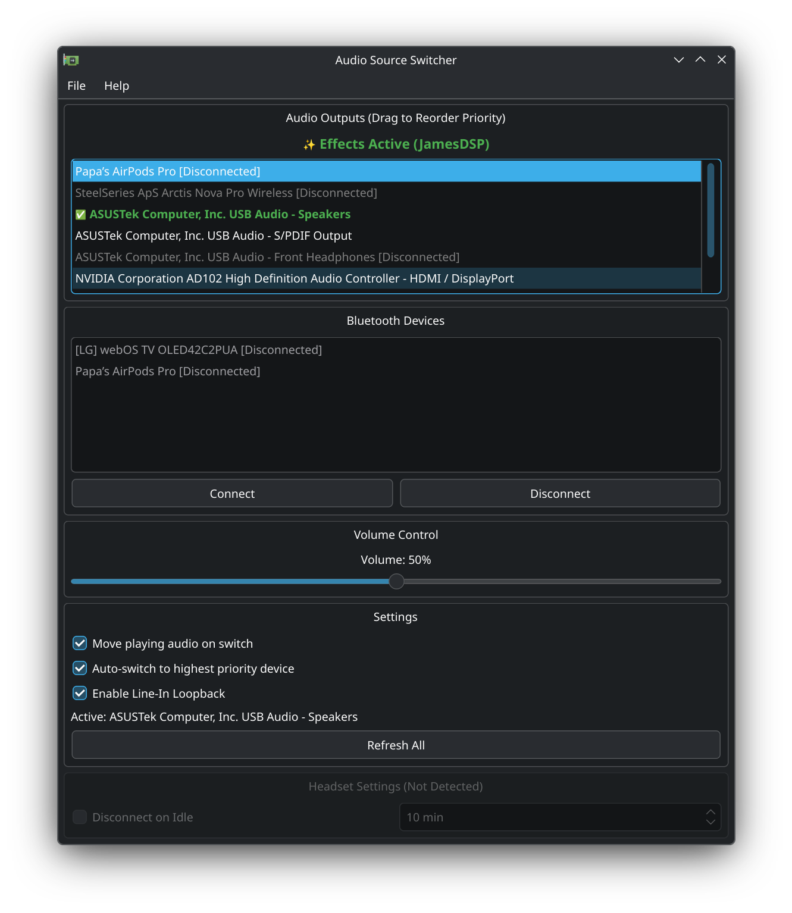
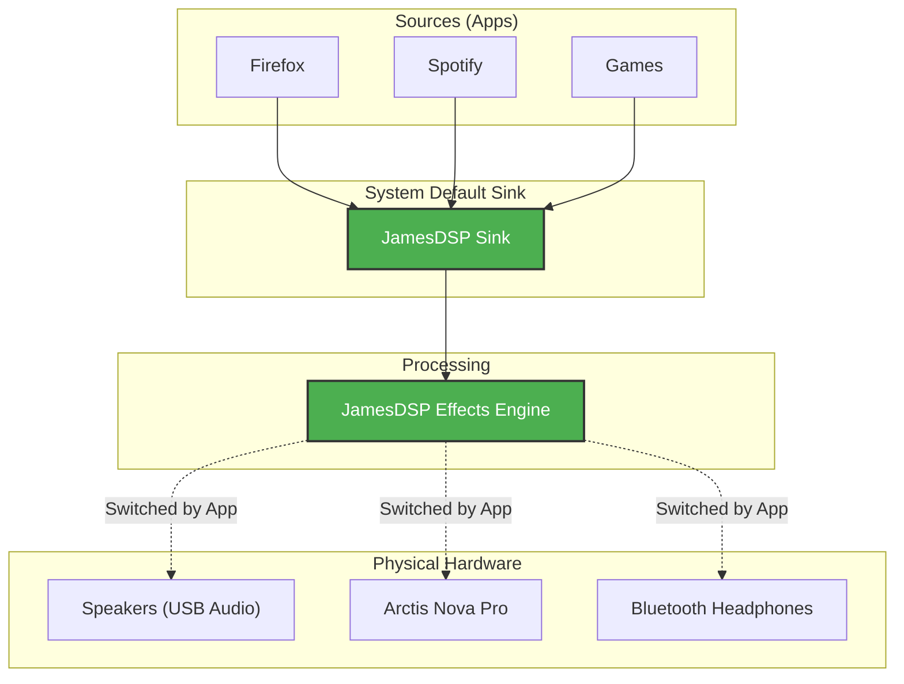

# Audio Source Switcher

A powerful PyQt6-based utility for Linux (specifically KDE Plasma/Wayland) to manage audio output devices and Bluetooth connections.

## Table of Contents
- [Features](#features)
- [Audio Routing & JamesDSP Integration](#audio-routing--jamesdsp-integration)
- [CLI & Global Hotkeys](#cli--global-hotkeys)
- [Installation](#installation)
- [Configuration](#configuration)
- [Changelog](#changelog)



## Features

- **Smart Device List**: Shows PulseAudio sinks and Bluetooth devices in a unified list.
- **Priority Auto-Switching**: Drag-and-drop devices to reorder. The app automatically switches to the highest-priority connected device.
- **Microphone Association**: 
    - Automatically switch inputs when changing outputs.
    - **Link Microphone**: Manually link specific mics to specific outputs (e.g. use "Yeti Nano" when "Speakers" are active).
    - **Auto Mode**: Intelligently matches Bluetooth/USB devices (e.g. AirPods Output -> AirPods Mic).
- **Offline Management**: Remembers devices even when they are disconnected, allowing you to maintain your priority order.
- **Improved Bluetooth Support**:
    - Connect/Disconnect directly from the UI.
    - **Connect on Select**: Clicking an offline Bluetooth device triggers an auto-connect sequence.
    - **Stable Naming**: Uses MAC addresses to properly identify devices like AirPods.
- **Headset Integration**:
    - Supports **SteelSeries Arctis Nova Pro Wireless**.
    - Displays battery percentage (e.g., `[87%]`) when connected via USB.
    - Detects "disconnected" state correctly (when powered off) to allow auto-switching to speakers.
    - **Idle Control**: Configure "Disconnect on Idle" timeout (1-90 mins) directly from the UI to save battery.
- **System Tray**:
    - Minimizes to tray on close.
    - Notifications on auto-switch (via `notify-send`).

## Audio Routing & JamesDSP Integration

This tool includes smart integration for **JamesDSP**. Instead of simply changing the system default sink (which would bypass effects), it intelligently rewires the PipeWire graph.

### How it Works

When JamesDSP is running, the app treats it as a **Virtual Output Filter**.
1.  **Apps** send audio to `jamesdsp_sink` (System Default).
2.  **JamesDSP** processes the audio.
3.  **The Switcher** automatically connects JamesDSP's *Output* to your chosen physical device (Speakers, Headphones).



**Benefits:**
- **No Effect Dropouts**: You never lose your EQ/Bass Boost when switching devices.
- **Auto-Switching**: If your Headphones disconnect, the app detects the "Floating" JamesDSP output and immediately rewires it to your Speakers.
- **Exclusive Routing**: The app actively unlinks old connections to ensure audio plays *only* to the selected device (fixing duplicate audio issues).

### Stability & UX
- **Startup Enforcement**: If you reboot and the system defaults back to hardware (bypassing effects), the app automatically "claims" the audio stream for JamesDSP when launched.
- **Circuit Breaker**: If JamesDSP crashes or enters a zombie state (Sink present but Process missing), the app will detect the failure and **auto-fallback** to hardware switching to prevent infinite loops.
    - *To Reset*: Once you fix JamesDSP, simply **Manually Click** a device in the list to re-enable effects.
- **Visual Feedback**:
    - **Active Device**: Highlighted in **Bold Green** with a ✅ checkmark.
    - **Effects Indicator**: A "✨ Effects Active" banner confirms traffic is routing through the filter.


## CLI & Global Hotkeys

Since version 11.1, you can control the app from the command line, which is perfect for setting up global hotkeys (especially on Wayland).

### Usage
```bash
# Connect/Switch to a specific device (by name or ID)
python3 audio_source_switcher.py --connect "AirPods Pro"

# The app effectively "Headless" in this mode:
# ...
```

### Setting up a Hotkey (KDE Plasma)
1.  Open the app and **Right-Click** the device you want to bind.
2.  Select **"Copy Hotkey Command"**.
3.  Go to **System Settings** -> **Shortcuts** -> **Custom Shortcuts**.
4.  Create a new shortcut, name it (e.g., "Connect Headphones").
5.  Paste the command into the **Action/Command** field.
6.  Assign your desired key combination (e.g., `Meta+H`).

### How to Override System Volume Shortcuts (KDE Plasma)

To ensure your volume keys control the hardware (bypassing JamesDSP), you must rebind them to this app.

1.  **Open Shortcuts**: Go to **System Settings** -> **Shortcuts**.
2.  **Unbind Defaults**:
    -   Search for **"Audio Volume"**.
    -   Find "Volume Up" and set it to **None** (or Custom).
    -   Find "Volume Down" and set it to **None**.
3.  **Create Custom Shortcuts**:
    -   Click **Add New**.
    -   **Name**: "Smart Volume Up".
    -   **Command**: `python3 /path/to/audio-source-switcher/audio_source_switcher.py --vol-up`
    -   **Shortcut**: Press your physical `Volume Up` key.
    -   Repeat for "Smart Volume Down" using `--vol-down`.

> [!TIP]
> **Locked Media Keys?**
> If your system refuses to unbind the standard media keys (e.g., Fn+F12), try binding a combination like `Alt+F12` (or `Alt+VolumeUp`) instead. This is often easier to configure and reliable on all keyboards.

**Note**: The app will now show a visual satisfaction bar (OSD) when you change volume, confirming it's working.

- Python 3
- `PyQt6`
- `pulseaudio` / `pipewire-pulse` (pactl)
- `bluez` (bluetoothctl)
- `libnotify` (notify-send)
- `headsetcontrol` (optional, for Arctis Nova battery/status)

## Installation

1.  **Dependencies**:
    Install the required system packages. Avoid using `pip` for system-wide Qt libraries to prevent conflicts.

    ### Arch Linux / CachyOS
    ```bash
    sudo pacman -S python-pyqt6 libnotify bluez-utils
    # headsetcontrol is available in the AUR
    ```

    ### Ubuntu / Debian
    *Note: Debian/Ubuntu support is theoretical and not actively tested.*
    ```bash
    sudo apt update
    sudo apt install python3-pyqt6 libnotify-bin bluez pulseaudio-utils
    # headsetcontrol must be built from source or installed via .deb if available
    ```

2.  **Desktop Shortcut**:
    Copy the provided `.desktop` file to your applications folder:
    ```bash
    cp audio-source-switcher.desktop ~/.local/share/applications/
    update-desktop-database ~/.local/share/applications/
    ```

## Configuration

Device priority and settings are saved to `~/.config/audio-source-switcher/config.json`.

## Changelog

### v11.6
- **Notification Sounds**: Desktop notifications now play a sound (using freedesktop sound theme).

### v11.5
- **Microphone Association**: Added context menu option to link specific microphones to output devices.
- **Smart Mic Switching**: Automatically switches input device when output changes.
- **Bluetooth Names**: Fixed issue where some Bluetooth mics showed as `(null)`.

### v11.4
- Added **Headset Settings** section.
- Added **Disconnect on Idle** configuration for SteelSeries Arctis headphones (requires `headsetcontrol`).

### v11.3
- Added **About** menu item to the System Tray context menu.
- Updated internal help text to reflect new CLI options.

### v11.2
- Fixed window size not being restored when opening from tray.
- Fixed system tray icon label/tooltip.

### v11.1
- Added CLI control (`--connect`, `--vol-up`, `--vol-down`)
- Added global hotkey support for Wayland

### Earlier Development (pre-versioning)
- **Volume Control**: Smart volume routing to hardware (bypassing JamesDSP sink)
- **Jack Detection**: Physical headphone jack monitoring
- **JamesDSP Integration**: Intelligent graph rewiring for audio effects
- **Project Rename**: Renamed from earlier prototype
- **Priority Auto-Switching**: Drag-and-drop device priority ordering
- **Bluetooth Management**: Connect/disconnect directly from UI
- **System Tray**: Minimize to tray, notifications on auto-switch
- **Offline Device Memory**: Maintains priority order for disconnected devices
- **Initial Release**: Basic PulseAudio sink switching with PyQt6 UI
