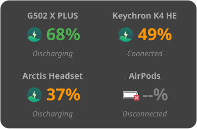

# Peripheral Battery Monitor
Version 1.2.3

A small, always-on-top, frameless window for Linux (optimized for KDE Wayland) that displays the battery levels of your Logitech and Keychron peripherals.



## Features
- **Logitech Support**: Uses `solaar` libraries to fetch precise mouse battery levels.
- **Keychron Support**:
  - **Bluetooth**: Uses `upower` to fetch battery levels %.
  - **Wired**: Detects USB connection and shows "Wired" status.
  - **Wireless (2.4G)**: Detects 2.4G receiver connection and shows "Wireless" status (battery level unavailable over 2.4G).
- **Arctis Headsets**: Uses `headsetcontrol` to fetch battery levels.
- **AirPods Support**: Advanced BLE scanning to fetch granular battery levels for Left, Right, and Case. Supports disconnected monitoring. Now with fallback logic and Case display!
- **Wayland Compatible**: Uses system-native movement for dragging.
- **KDE Plasma Integration**: Automatically installs KWin window rules for "Always on Top" and "No Titlebar".
- **Auto-Remember**: KWin remembers the window position and screen between sessions.
- **Compact UI**: Clean, dark-mode 2x2 grid dashboard showing all 4 devices.

## Requirements
- Python 3.12+ (tested on 3.14)
- `PyQt6` 
- `solaar`
- `upower` (for Bluetooth keyboards)
- `headsetcontrol` (for Arctis headsets)
- `bluez` (bluetoothctl)
- `python-bleak` (for AirPods BLE scanning)
- `python-structlog` (for structured logging)

## Quick Start
1. Ensure your Logitech mouse is connected (Unifying/Bolt receiver) and Keychron keyboard is paired via **Bluetooth**.
2. Run the installer:
   ```bash
   ./install.sh
   ```
3. Launch via your applications menu: **Peripheral Battery Monitor**

## Manual Usage
```bash
python3 peripheral-battery.py
# Or for troubleshooting:
python3 peripheral-battery.py --debug
```

## Logging
Logs are automatically saved in JSON format for debugging:
- **Location**: `~/.local/state/peripheral-battery-monitor/peripheral_battery.log`
- **Rotation**: Keeps 1 backup file (Max 5MB).

## Changelog

### v1.2.3
- Added screenshot to README

### v1.2.0
- Added AirPods BLE scanning with L/R/Case status
- Added fallback logic for disconnected device monitoring

### v1.1.0
- Added Arctis headset support via headsetcontrol
- Added structured logging with structlog

### v1.0.0
- Initial release
- Logitech mouse support via solaar
- Keychron keyboard support (Bluetooth/Wired/Wireless)
- KDE Wayland integration with KWin rules
