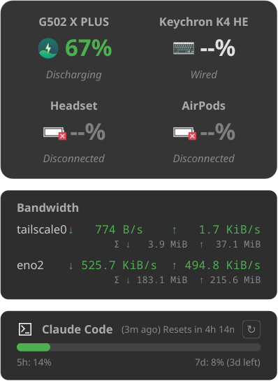

# Peripheral Battery Monitor
Version 1.8.0

A small, always-on-top, frameless window for Linux (optimized for KDE Wayland) that displays the battery levels of your Logitech and Keychron peripherals and connected Bluetooth headphones, real-time and cumulative bandwidth for arbitrary network interfaces (with Tailscale exit-node awareness), plus optional Claude Code API usage tracking.



## Table of Contents
- [Features](#features)
- [Requirements](#requirements)
- [Quick Start](#quick-start)
- [Manual Usage](#manual-usage)
- [Bandwidth Monitoring](#bandwidth-monitoring)
- [Logging](#logging)
- [Changelog](#changelog)

## Features
- **Logitech Support**: Uses `solaar` libraries to fetch precise mouse battery levels.
- **Keychron Support**:
  - **Bluetooth**: Uses `upower` to fetch battery levels %.
  - **Wired**: Detects USB connection and shows "Wired" status.
  - **Wireless (2.4G)**: Detects 2.4G receiver connection and shows "Wireless" status (battery level unavailable over 2.4G).
- **Headphones (vendor-neutral)**: The two bottom cells show whatever Bluetooth headphones are currently connected, prioritizing connected devices. Any headset that reports battery over BlueZ `org.bluez.Battery1` (e.g. Sony WH-1000XM6) appears automatically — no per-vendor code. AirPods and SteelSeries Arctis remain as enrichment sources:
  - **AirPods**: BLE scanning for granular Left, Right, and Case levels, merged in and de-duplicated by MAC.
  - **Arctis Headsets**: `headsetcontrol` for the USB dongle (not a BlueZ device).
- **Claude Code Integration**: Displays rate-limit utilization (5-hour and 7-day windows) with progress bar and countdown to reset, fetched directly from Anthropic's OAuth usage API. Auto-hides if Claude Code is not installed. Requires `claude login` for authentication.
- **Bandwidth Monitoring**: Configurable real-time and cumulative bandwidth for arbitrary network interfaces (e.g., `tailscale0`, `eno2`, `wg0`). Tailscale interfaces show the currently selected exit node in the row subtitle. Cumulative totals persist across restarts and can be reset per-interface from the context menu. See [Bandwidth Monitoring](#bandwidth-monitoring) for details.
- **Wayland Compatible**: Uses system-native movement for dragging.
- **KDE Plasma Integration**: Automatically installs KWin window rules for "Always on Top" and "No Titlebar".
- **Position Restore**: Reappears at its last on-screen position on the next launch. On KDE Wayland this is done via the KWin Scripting D-Bus API (`kwin_window_position.py`), because `move()`, Qt geometry, and KWin "Remember" position rules do not work reliably on Wayland. See the [Changelog](#changelog) for details.
- **Compact UI**: Clean, dark-mode 2x2 grid dashboard showing all 4 devices.

## Requirements
- Python 3.12+ (tested on 3.14)
- `PyQt6` 
- `solaar`
- `upower` (for Bluetooth keyboards)
- `headsetcontrol` (for Arctis headsets)
- `bluez` (BlueZ bluetooth daemon)
- `python-dbus` (BlueZ D-Bus interface)
- `python-bleak` (for AirPods BLE scanning)
- `python-structlog` (for structured logging)

## Quick Start
1. Ensure your Logitech mouse is connected (Unifying/Bolt receiver) and Keychron keyboard is paired via **Bluetooth**.
2. Run the installer:
   ```bash
   ./install.sh
   ```
3. Launch via your applications menu: **Peripheral Battery Monitor**

## Manual Usage
```bash
python3 peripheral-battery.py
# Or for troubleshooting:
python3 peripheral-battery.py --debug
```

## Bandwidth Monitoring

The bandwidth section sits between the battery grid and the Claude Code section. It is enabled by default but shows no rows until you add at least one interface.

### Configuring interfaces

Right-click the widget → **Bandwidth** → **Add Interface…** and enter the interface name as it appears in `/proc/net/dev` (e.g., `tailscale0`, `eno2`, `wg0`, `virbr0`). The list is persisted to `~/.config/peripheral-battery-monitor.json` under `bandwidth_interfaces`.

Each row shows:

- The interface name (with `→ exit: <hostname>` appended when the interface is a Tailscale interface routing through an exit node).
- The current down / up rate, refreshed every 2 seconds (e.g., `↓ 1.2 MiB/s  ↑ 50 KiB/s`).
- The cumulative down / up totals since the last reset (e.g., `Σ ↓ 1.5 GiB  ↑ 200 MiB`).

### Data sources

- **Byte counters**: read directly from `/proc/net/dev` (single open / read / close per 2-second tick, no subprocess).
- **Tailscale metadata**: when at least one configured interface name starts with `tailscale`, the section calls `tailscale status --json` at most once per minute to retrieve the current exit node hostname and backend state. Failures (missing binary, non-zero exit, parse error) degrade gracefully — the byte counters keep working, only the exit-node label goes blank.

The data layer (`bandwidth_reader.py`) is also runnable as a CLI for debugging:

```bash
python3 bandwidth_reader.py --json --tailscale-meta tailscale0 eno2
```

### Cumulative totals

Cumulative totals are computed by summing positive deltas across successive samples and are persisted to settings every ~30 seconds. When a kernel counter goes backwards (interface re-creation, reboot), the section detects the regression and re-anchors the baseline without subtracting from the cumulative — so totals only ever grow until you reset them.

To reset, right-click → **Bandwidth** → **`<iface>`** → **Reset cumulative**. To remove an interface entirely, use **Remove** in the same submenu.

### Hiding the section

Toggle visibility via **Bandwidth** → **Show Bandwidth Section**. When hidden, the polling timer stops, so a hidden section has no runtime cost.

## Logging
Logs are automatically saved in JSON format for debugging:
- **Location**: `~/.local/state/peripheral-battery-monitor/peripheral_battery.log`
- **Rotation**: Keeps 1 backup file (Max 5MB).

## Changelog

### v1.8.0

- **Window position save/restore on KDE Wayland.** The window now reappears at its last on-screen position on the next launch. This is implemented in a new reusable helper, `kwin_window_position.py`, that drives the KWin Scripting D-Bus API, because none of the usual approaches work on Wayland:
  - `QWidget.move()` is ignored by the compositor — a client cannot position itself.
  - `QWidget.pos()` / `windowHandle().geometry()` return a bogus value (a screen-origin-ish number, not the real position); the compositor is the only source of truth.
  - `QMoveEvent` does not fire for compositor-driven moves (including `startSystemMove()` drags), so it cannot be used as a save trigger.
  - KWin "Remember"/"Force" position rules only pick the screen and snap to its origin; they do not honor exact intra-screen coordinates. The previous `positionrule=4` rule never actually restored the position.
  - Native session restore (`xx-session-management-v1`) needs Qt 6.12+, which is not yet packaged.
- **How it works**: on startup a one-shot KWin script sets the window's `frameGeometry` to the saved coordinates; after a drag, a KWin script reads the true geometry and reports it back over D-Bus, which is persisted to the config (`window_x` / `window_y`). Degrades to a no-op off KDE.
- The `install_kwin_rule.py` installer no longer sets the dead `positionrule`/`sizerule`/`screenrule` remember rules and clears any a previous version left behind.

### v1.7.0

- The two bottom (headphone) cells are now vendor-neutral. Instead of one cell pinned to SteelSeries Arctis and the other to Apple AirPods, both cells show whatever Bluetooth headphones are currently connected, prioritizing connected devices. A new generic reader enumerates connected Bluetooth audio devices via the BlueZ D-Bus `ObjectManager` and reads `org.bluez.Battery1`, so any headset that reports battery (e.g. Sony WH-1000XM6) appears automatically — no per-vendor code.
- AirPods (BLE L/R/case) and SteelSeries Arctis (`headsetcontrol`, a USB dongle) are kept as enrichment sources, merged into the headphone pool and de-duplicated by MAC; the richer entry wins.
- Headphones are ranked connected-first: devices with a known battery level rank ahead of connected-but-unknown devices. The top two fill the `headphone1`/`headphone2` slots.
- The "Connected / unknown level" merge fallback is now guarded by device name, so a slot whose occupant changes between polls cannot bleed the previous device's battery level onto a different device.
- Fix: test mock (`MockQLabel`) was missing `setScaledContents`, which broke every test that instantiates the monitor since v1.6.x.

### v1.6.1

- Fix blank mouse title after a reboot. At desktop startup the Logitech receiver may not be fully enumerated, so solaar can return an empty `dev.name` and latch it on the cached device object — the title stayed blank until the monitor was restarted. The cached device is now evicted when its name resolves blank, so the next poll rebuilds a fresh object and re-resolves the name. Device names are stripped, and a blank/whitespace name falls back to the default label instead of rendering an empty title.

### v1.6.0

- Add configurable bandwidth section between the battery grid and the Claude section. Shows real-time and cumulative rx/tx for an arbitrary list of interfaces.
- `/proc/net/dev` is the primary source; `tailscale status --json` is consulted only as a metadata enrichment (current exit node hostname, backend state) and is rate-limited to at most one call per minute.
- Cumulative totals persist across app restarts in `~/.config/peripheral-battery-monitor.json` and can be reset per-interface from the context menu.
- Counter wrap / interface re-creation is detected and re-anchored without producing negative rates or cumulative regressions.
- Bandwidth section is hideable via the **Bandwidth → Show Bandwidth Section** menu; when hidden the polling timer stops.

### v1.5.6
- Weekly quota label (bottom-right of Claude section) now shows days remaining in the period, e.g. `7d: 25% (5d left)`. Sub-day shows `<1d left`; missing/past timestamps render the original form.

### v1.5.5
- Backoff warning now displays as a compact icon (⚠) in the header row with details on hover, instead of a full-width label that changed widget height and caused clipping at screen edges

### v1.5.4
- Fix solaar-keyboard uinput leak: pre-mock evdev before importing solaar to prevent diversion module from creating a kernel input device on every subprocess poll

### v1.5.3
- Fix solaar receiver fd leak: close hidraw handle between polls to prevent "solaar-keyboard" input device accumulation in dmesg

### v1.5.2
- Activity check now triggers refresh on every new file change (no longer limited to once per cycle)
- Configurable activity check interval (1-5 minutes) via right-click menu under Claude Code
- Backoff indicator in Claude widget warns when rate limiting is active so the user can increase the interval
- All error states now fall back to cached data instead of clearing the widget
- Manual refresh no longer clears the widget on transient errors

### v1.5.1
- Show cached usage data during rate limiting instead of clearing the widget
- Added staleness indicator ("Xm ago") showing time since last successful refresh

### v1.5.0
- Reduced API polling from 30s to 10-minute intervals to avoid rate limiting
- Added activity-based smart refresh: monitors Claude session file timestamps and triggers one early refresh when new activity is detected
- Added refresh button (↻) in the Claude section header for manual usage stat updates

### v1.4.2
- Fixed usage API monitor getting permanently stuck on "API error" due to HTTP 429 rate limiting with no backoff
- Usage API calls now respect `Retry-After` headers and apply exponential backoff on errors (base 60s for HTTP errors, 120s default for 429s, 10-min cap)
- "Refresh Now" context menu action now resets both OAuth and usage API backoff
- UI shows "Rate limited" instead of generic "API error" for 429 responses

### v1.4.1
- Fixed recurring crash caused by QThread `deleteLater` race condition (Python GC destroying worker wrapper before Qt processed deferred delete)
- Added exponential backoff to OAuth token refresh — stops hammering the token endpoint on persistent 403s (transient errors cap at 5 min, permanent at 30 min)
- OAuth backoff resets automatically when credentials file changes on disk (e.g., after `claude login`)
- "Refresh Now" context menu action bypasses any active backoff
- Reduced log spam: repeated OAuth failures log at debug level after the first warning
- Code cleanup: removed dead code, fixed indentation inconsistencies

### v1.4.0
- Replaced local JSONL token scraping with Anthropic's OAuth usage API (`GET /api/oauth/usage`)
- Claude section now shows 5-hour and 7-day utilization percentages directly from Anthropic's servers
- Automatic OAuth token refresh when expired
- Removed manual calibration workflow (budget, window duration, reset hour settings)
- Requires `claude login` authentication (uses `~/.claude/.credentials.json`)

### v1.3.4
- Fixed AirPods battery not reporting after bluez 5.86 update. Replaced `bluetoothctl` CLI with D-Bus for connection detection. BLE scan no longer gated on stale CLI output.
- Removed dead code and fixed double `scanner.stop()` in BLE scan.

### v1.3.3
- Fixed Logitech mouse battery not updating properly after state transitions (charging to discharging)
- Now always pings device before reading battery to ensure fresh state
- UI clears cached battery levels when status changes between charging/discharging states

### v1.3.2
- Expanded reset hour menu to show all 24 hours (previously only showed every 2 hours)

### v1.3.1
- Fixed bug where Claude Code section would permanently hide when no activity data was available in the current session window
- Section now shows "No activity" state instead of hiding when there's no data

### v1.3.0
- Added Claude Code usage stats section below the battery grid
- Window-based token counting (matches Claude's 4-hour session windows for Max plans)
- Shows token usage with progress bar (color-coded: green/yellow/red by percentage)
- Displays countdown to window reset and API call count
- Auto-hides if Claude Code is not installed
- Configurable session budget via right-click menu (10k-1M, Unlimited)
- Configurable window duration via right-click menu (1h-12h)
- Configurable reset hour to align with Claude's actual session windows (from `/usage`)
- Toggle visibility via right-click menu

### v1.2.4
- Keychron: Bluetooth battery now prioritized over "Wired" status when keyboard is charging via USB but connected via BT

### v1.2.3
- Added screenshot to README

### v1.2.2
- Added faulthandler import for debugging
- Refactored data fetching via subprocess

### v1.2.1
- Relaxed BLE RSSI threshold to -85
- 30-second battery status refresh interval
- Prevented worker thread overlap

### v1.2.0
- Added AirPods BLE scanning with L/R/Case status
- Added fallback logic for disconnected device monitoring
- Added unit tests for battery logic

### v1.1.1
- Single instance enforcement via QLockFile
- Dynamic battery status icons in UI
- Fixed mouse device resource exhaustion (dbus/systemd cache)

### v1.1.0
- Added Arctis headset support via headsetcontrol
- Added structured logging with structlog

### v1.0.1
- Enhanced Keychron support for Wired/Bluetooth/2.4G connections

### v1.0.0
- Initial release
- Logitech mouse support via solaar
- Keychron keyboard support (Bluetooth)
- KDE Wayland integration with KWin rules
