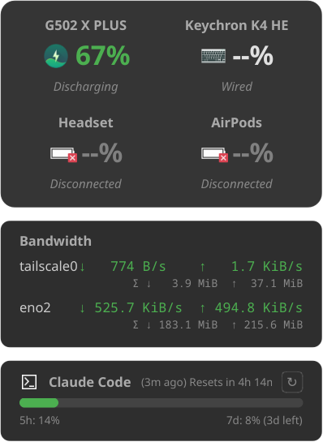

# Peripheral Battery Monitor
Version 1.20.0

A small, always-on-top, frameless window for Linux (optimized for KDE Wayland) that shows two configurable device cells (Logitech mouse, Keychron keyboard, or connected Bluetooth headphones), real-time and cumulative bandwidth for arbitrary network interfaces (with Tailscale exit-node awareness), liquid-cooler thermals, plus optional Claude Code API usage tracking.



## Table of Contents
- [Features](#features)
- [Requirements](#requirements)
- [Quick Start](#quick-start)
- [Manual Usage](#manual-usage)
- [Bandwidth Monitoring](#bandwidth-monitoring)
- [AIO Monitoring](#aio-monitoring)
- [Logging](#logging)
- [Changelog](#changelog)

## Features
- **Two Configurable Slots**: The top area shows two cells, each selectable (right-click → Devices) to show any supported device type: Mouse, Keyboard, Headphone, the secondary Headphone, or a Bluetooth Device (see below). Defaults to Mouse (left) and the current Headphone (right); a slot with nothing connected shows a placeholder.
- **Non-Headphone Bluetooth Devices (vendor-neutral)**: The "Bluetooth Device" / "Bluetooth Device (2nd)" slot categories surface the battery of any connected *non-audio* Bluetooth device that reports `org.bluez.Battery1` — e.g. a Bluetooth mouse, keyboard, trackpad, gamepad, or stylus. Like the Headphone slots, they are ranked connected-first (highest known level first) and need no per-vendor code. Audio devices stay in the Headphone category.
- **Logitech Support**: Uses `solaar` libraries to fetch precise mouse battery levels.
- **Keychron Support**:
  - **Bluetooth**: Uses `upower` to fetch battery levels %.
  - **Wired**: Detects USB connection and shows "Wired" status.
  - **Wireless (2.4G)**: Detects 2.4G receiver connection and shows "Wireless" status (battery level unavailable over 2.4G).
- **Headphones (vendor-neutral)**: The Headphone slot shows the current, most-recently-connected active headphone, switching automatically as you connect/disconnect devices. Any headset that reports battery over BlueZ `org.bluez.Battery1` (e.g. Sony WH-1000XM6) appears automatically — no per-vendor code. AirPods and SteelSeries Arctis remain as enrichment sources:
  - **AirPods**: live Left/Right/Case battery is read directly over Apple's Accessory Protocol (AAP) on an L2CAP channel (PSM 0x1001) — the same mechanism [LibrePods](https://github.com/librepods-org/librepods) uses — so a real percentage shows even though BlueZ does not expose one. Requires the AirPods to be paired and connected; no root or BlueZ experimental mode needed. Falls back to a BLE advertisement scan, then to presence-only ("Connected") if neither yields data.
  - **Arctis Headsets**: `headsetcontrol` for the USB dongle (not a BlueZ device).
- **Claude Code Integration**: Displays rate-limit utilization (5-hour and 7-day windows) with progress bar and countdown to reset, fetched directly from Anthropic's OAuth usage API. Auto-hides if Claude Code is not installed. Requires `claude login` for authentication.
- **Bandwidth Monitoring**: Configurable real-time and cumulative bandwidth for arbitrary network interfaces (e.g., `tailscale0`, `eno2`, `wg0`). Tailscale interfaces show the currently selected exit node in the row subtitle. Cumulative totals persist across restarts and can be reset per-interface from the context menu. See [Bandwidth Monitoring](#bandwidth-monitoring) for details.
- **AIO Monitoring (read-only)**: CPU temperature, coolant temperature with a 5-minute sparkline, fan/pump speeds and cooling alerts, read from `liquidctl` and a running [OpenLinkHub](https://github.com/jurkovic-nikola/OpenLinkHub) daemon. Nothing here writes to the cooler: its RGB, its LCD, the scenes and the numpad shortcuts moved to [hotaru](https://github.com/ushineko/hotaru). The section stays hidden unless a source reports something, so a machine without either is unaffected. See [AIO Monitoring](#aio-monitoring) for details.
- **Wayland Compatible**: Uses system-native movement for dragging.
- **KDE Plasma Integration**: Automatically installs KWin window rules for "Always on Top" and "No Titlebar".
- **Position Restore**: Reappears at its last on-screen position on the next launch. On KDE Wayland this is done via the KWin Scripting D-Bus API (`kwin_window_position.py`), because `move()`, Qt geometry, and KWin "Remember" position rules do not work reliably on Wayland. See the [Changelog](#changelog) for details.
- **Compact UI**: Clean, dark-mode dashboard with two configurable device cells at the top.

## Requirements
- Python 3.12+ (tested on 3.14)
- `PyQt6` 
- `solaar`
- `upower` (for Bluetooth keyboards)
- `headsetcontrol` (for Arctis headsets)
- `bluez` (BlueZ bluetooth daemon)
- `python-dbus` (BlueZ D-Bus interface)
- `python-bleak` (for AirPods BLE scanning)
- `python-structlog` (for structured logging)
- `openlinkhub` (optional, for the AIO section)

## Quick Start
1. Ensure your Logitech mouse is connected (Unifying/Bolt receiver) and Keychron keyboard is paired via **Bluetooth**.
2. Run the installer:
   ```bash
   ./install.sh
   ```
3. Launch via your applications menu: **Peripheral Battery Monitor**

## Manual Usage
```bash
python3 peripheral-battery.py
# Or for troubleshooting:
python3 peripheral-battery.py --debug
```

## Bandwidth Monitoring

The bandwidth section sits between the battery grid and the Claude Code section. It is enabled by default but shows no rows until you add at least one interface.

### Configuring interfaces

Right-click the widget → **Bandwidth** → **Add Interface…** and enter the interface name as it appears in `/proc/net/dev` (e.g., `tailscale0`, `eno2`, `wg0`, `virbr0`). The list is persisted to `~/.config/peripheral-battery-monitor.json` under `bandwidth_interfaces`.

Each row shows:

- The interface name (with `→ exit: <hostname>` appended when the interface is a Tailscale interface routing through an exit node).
- The current down / up rate, refreshed every 2 seconds (e.g., `↓ 1.2 MiB/s  ↑ 50 KiB/s`).
- The cumulative down / up totals since the last reset (e.g., `Σ ↓ 1.5 GiB  ↑ 200 MiB`).

### Data sources

- **Byte counters**: read directly from `/proc/net/dev` (single open / read / close per 2-second tick, no subprocess).
- **Tailscale metadata**: when at least one configured interface name starts with `tailscale`, the section calls `tailscale status --json` at most once per minute to retrieve the current exit node hostname and backend state. Failures (missing binary, non-zero exit, parse error) degrade gracefully — the byte counters keep working, only the exit-node label goes blank.

The data layer (`bandwidth_reader.py`) is also runnable as a CLI for debugging:

```bash
python3 bandwidth_reader.py --json --tailscale-meta tailscale0 eno2
```

### Cumulative totals

Cumulative totals are computed by summing positive deltas across successive samples and are persisted to settings every ~30 seconds. When a kernel counter goes backwards (interface re-creation, reboot), the section detects the regression and re-anchors the baseline without subtracting from the cumulative — so totals only ever grow until you reset them.

To reset, right-click → **Bandwidth** → **`<iface>`** → **Reset cumulative**. To remove an interface entirely, use **Remove** in the same submenu.

### Hiding the section

Toggle visibility via **Bandwidth** → **Show Bandwidth Section**. When hidden, the polling timer stops, so a hidden section has no runtime cost.

## AIO Monitoring

The AIO section sits between the bandwidth section and the Claude Code section. It shows liquid-cooler thermals from two sources — `liquidctl` for the cooler, and a running [OpenLinkHub](https://github.com/jurkovic-nikola/OpenLinkHub) daemon for the CPU package temperature:

- **CPU**: CPU package temperature, from OpenLinkHub's `/api/cpuTemp`.
- **Coolant**: liquid temperature reported by the cooler, with a colour band and a sparkline.
- **Fans**: mean RPM across the cooler's fans, the fan count, and pump RPM.

A **cooling alert** fires a desktop notification when the pump stops or the coolant runs hot. See [Cooling alerts](#cooling-alerts).

### The sparkline

The graph covers the last 5 minutes: 60 samples at a 5-second cadence, right-anchored so "now" is the right edge. It carries two traces:

- **Coolant**, plotted raw, in the current band colour. This is the primary trace.
- **CPU**, plotted as a 60-second trailing mean, in muted steel blue. Raw CPU is unreadable at this size, since it spikes to 100 °C on any compile. Averaged, it becomes a trend line, and the interesting part is its correlation with coolant: CPU leads, coolant follows, and the lag between them is the loop's thermal inertia.

There is no legend. Each row's value label is painted in its trace's colour, which is the mapping.

**Heights are not comparable between the two traces.** They are scaled independently, each to its own min/max, because they do not share a usable axis: in one session CPU ranged 65–98 °C while coolant moved 45.8–46.6 °C, roughly 40:1. On a shared axis a 3 °C coolant climb would occupy about 2 px of a 26 px box. Read shape and correlation from the graph; read values from the rows above it.

Each trace has a 5 °C minimum span, so an idle flat line stays flat instead of amplifying sensor jitter into a mountain range. History is in-memory only and starts empty after a restart. If the daemon drops out, no sample is recorded and the gap is not interpolated.

### Coolant colour bands

| Coolant | Colour | Meaning |
| ------- | ------ | ------- |
| below 50 °C | green | normal |
| 50–55 °C | amber | warming; heat-soaked case |
| 55 °C and above | red | warning band |

The thresholds come from the behaviour of a Corsair H150i ELITE LCD on this machine. Its pump-head over-temperature alarm tripped at 57.1 °C and cleared near 50 °C. CPU temperature is not colour-graded: its colour identifies its trace, not a severity. A high boost temperature is normal and grading it would flag every compile.

### Data source and supported devices

The cooler is read from `liquidctl --json status` first, falling back to OpenLinkHub. `lm_sensors` and sysfs `hwmon` are not consulted, and for this hardware they could not be: the NZXT Kraken Elite V2 (`1e71:3012`) is not matched by the kernel's `nzxt-kraken3` driver — which covers `2007/2014/3008/300C/300E` — so no hwmon node exists and `sensors` reports nothing for it. liquidctl is the only source of pump RPM and coolant temperature.

OpenLinkHub classification is by the daemon's channel `description`, so no device serial or product name is hardcoded. A controller with fans but no cooler shows the fan row and no coolant row.

**Only genuine cooler channels are accepted as coolant.** The OpenLinkHub fallback matches `AIO`, `Pump`, `Water Block` and `Liquid`, and deliberately ignores everything else. A Corsair HX1000i PSU reports `description: "Probe"` channels named "VRM Temperature" and "PSU Temperature"; accepting any channel carrying a temperature — as versions before 1.17.0 did — surfaced a PSU sensor as coolant beside a pump reading of `0`. That is indistinguishable from a stopped pump, and would equally have masked a real one.

The data layer (`aio_reader.py`) is runnable as a CLI for debugging:

```bash
python3 aio_reader.py --json
```

Set `OPENLINKHUB_API` to override the default endpoint (`http://127.0.0.1:27003/api`).

### Lighting, the LCD and the scenes moved to hotaru

They are not here any more. [hotaru](https://github.com/ushineko/hotaru) owns
every write to this cooler and to every lit device: colours and effects per
device, zone and LED, the 640x640 panel, named scenes, and the eighteen numpad
shortcuts this widget used to register.

**The line is writes.** This program reads the cooler and shows what it finds,
and it keeps doing that until it is rewritten in Go and becomes a consumer of
hotaru's API rather than a second reader.

Why it moved rather than being kept in both places: two processes writing one
hidraw node is the failure this whole area spent eighteen specs avoiding, and
a widget is the wrong place for something that has to run before anybody logs
in and keep running whether or not the widget is open.

	hotaru light set purple          the colours that were in the menu
	hotaru scene apply evening       the scenes that were on the numpad
	hotaru screen dashboard          the LCD

### Nothing here writes

**No writes of any kind**, and a test asserts it: no speed-write endpoint, no
RGB write path, and none of the lighting or LCD modules present in the project.

Historical note: this restriction began as a hardware fact. Commander ST firmware 2.x silently discarded duty writes from both OpenLinkHub and liquidctl — they reported success and changed nothing — so a speed slider would have lied about working. That cooler has since been replaced by an NZXT Kraken Elite V2, whose liquidctl driver does expose working `set_speed_profile` on both the `pump` and `fan` channels. The restriction is now a scope decision rather than a firmware limit, and lifting it would be a new spec.

### Degradation

- **OpenLinkHub not installed, not running, or managing no supported device**: the CPU row is hidden. If liquidctl still reports a cooler, the coolant and fan rows remain. A slow 30-second probe keeps running, so starting the daemon later brings the row in without restarting the app.
- **liquidctl missing, failing, or reporting no cooler**: the coolant and pump rows fall back to OpenLinkHub, and are hidden if it has no cooler either. A missing pump reading never raises an alert — absence of evidence is not a stopped pump.
- **Neither source available**: the section stays hidden and the window is unchanged.
- **Daemon disappears after working**: the section stays visible with its last values dimmed and `(unavailable)` in the header. Sparkline history is kept and the gap is not interpolated. Recovery clears the marker.
- **Partial data**: any metric that cannot be read hides its own row. The section stays up as long as one row has data, and the graph stays up as long as either trace has data.

Fetching uses `QNetworkAccessManager` with a 2-second transfer timeout, so a hung daemon cannot stall the UI. liquidctl runs through `QProcess` with a 5-second kill deadline for the same reason: it opens a hidraw node, and contention on that bus has produced multi-second stalls on this machine. A poll is skipped entirely while a previous one is still outstanding, so slow sources cannot queue up behind each other.

### Cooling alerts

The section raises a desktop notification (`notify-send`) when cooling looks wrong:

| State | Condition |
| --- | --- |
| `critical` | coolant at or above 60 °C, or pump reporting 0 RPM |
| `warning` | pump below 500 RPM, or coolant at or above 50 °C |

A state must persist for three consecutive polls (~15 s) before it notifies, so a single partial read cannot fire one. While a condition persists it re-notifies at most every 10 minutes, and notifications replace rather than stack. Recovery sends one `Cooling recovered` notification.

This exists because the previous cooler's pump died with no warning: the CPU reached 100 °C and hard-throttled to 0.20 GHz while the widget displayed a plausible number. Alerting deliberately does not depend on anyone looking at the widget.

### Hiding the section

Toggle visibility via right-click → **AIO** → **Show AIO Section**. When hidden, the polling timer stops, so a hidden section has no runtime cost.

## Logging
Logs are automatically saved in JSON format for debugging:
- **Location**: `~/.local/state/peripheral-battery-monitor/peripheral_battery.log`
- **Rotation**: Keeps 1 backup file (Max 5MB).

## Changelog

### v1.20.0

- **The AIO lighting, LCD, scenes and hotkeys are gone.** They moved to
  [hotaru](https://github.com/ushineko/hotaru), which drives every lit device
  on the machine and the cooler's panel, and which reaches the cooler directly
  over `/dev/hidraw` rather than through a liquidctl subprocess per write. The
  line is **writes**: this widget still reads the cooler and still raises the
  cooling alert, because an alert is owned where it is visible.
  - Removed: `rgb_openrgb.py`, `aio_scenes.py`, `scene_service.py`,
    `scene_shortcuts.py`, `aio_liquid.py`, `aio_dashboard.py`, `aio_color.py`,
    `build_reels.py`, the `aio-scene` CLI, and their tests.
  - `aio_section.py` keeps the poll, the rows, the sparkline and the alert, and
    loses the Colour, Effect, Brightness, Scenes and LCD menus, the lighting
    re-assert and the dashboard push loop — from 1450 lines to 750.
  - The eighteen `AIOScene*` shortcut registrations are gone, so the numpad is
    hotaru's. KDE keeps its own record of a registered shortcut and rewrites
    `kglobalshortcutsrc` from memory whenever anything registers, so the stale
    entries were cleared through `org.kde.KGlobalAccel.unregister` rather than
    by editing that file; removing `scene_shortcuts.py` is what stops them
    coming back.
  - One commit rather than a staged removal: two processes writing one hidraw
    node is the invariant this area has been most careful about. Concurrent
    *reads* continue and are fine.
  - The `openrgb-server` user unit stays. It is hotaru's dependency now.

### v1.18.0 – v1.19.0

No changelog entries were written for these. The version in
`peripheral-battery.py` was bumped by specs 037 and 038 — the lighting
re-assert and the keyboard joining scenes — and both of those features have
since moved to hotaru with the rest of the lighting. Recorded here as a gap
rather than reconstructed after the fact.

### v1.17.0

- **liquidctl is now the primary cooler source.** The machine's cooler is an NZXT Kraken Elite V2 (`1e71:3012`), which the kernel's `nzxt-kraken3` driver does not match, so no hwmon node exists and `sensors` reports nothing. `liquidctl --json status` supplies coolant temperature, pump RPM and fan speed; OpenLinkHub remains the fallback cooler source and the only source of CPU package temperature.
- **Fixed: a PSU sensor was being displayed as coolant.** The OpenLinkHub cooler fallback accepted any channel reporting a temperature. After the Corsair cooler was removed, the nearest match became the HX1000i PSU's `description: "Probe"` channels, so the section showed "VRM Temperature" as coolant with `pump_rpm: 0` beside it — a reading indistinguishable from a stopped pump, and one that would equally have masked a real pump failure. The fallback now matches only genuine cooler descriptions (`AIO`, `Pump`, `Water Block`, `Liquid`).
- **`pump_rpm` now distinguishes "not reported" from "zero".** It is `None` when no source reports it and an int when one does, so `0` unambiguously means a pump reading zero.
- **New: cooling alerts.** A desktop notification fires when the pump stops or coolant runs hot, debounced across three consecutive polls, rate-limited to one per 10 minutes while a condition persists, with a recovery notification when it clears. Missing pump data never alerts. This follows a real incident in which the previous pump died silently and the CPU reached 100 °C and hard-throttled to 0.20 GHz while the widget displayed a plausible number.
- **liquidctl runs via `QProcess`**, never `subprocess`, on a 5-second kill deadline — the GUI thread is never blocked, matching the existing rule for HTTP fetches.
- New `cooler_source` field in the snapshot records which source supplied the cooler reading (`liquidctl`, `openlinkhub`, or `None`), so logs can distinguish "no cooler" from "no daemon".

### v1.16.0

- **RGB control from the context menu.** Right-click → **AIO** now offers Colour, Effect, and Brightness submenus, bringing the capability of `sysadmin/scripts/aio-color.sh` into the widget. Colour names and values match the script exactly.
  - `aio_color.py` builds the request sequences; the section executes them over the existing `QNetworkAccessManager`. Requests are grouped into ordered stages, and a stage is dispatched only once the previous one has finished — the override must land before the profile select, and reversing that is a silent no-op on the hardware.
  - When brightness is 0, applying a colour raises it to 100% first. At 0 every LED is dark and the colour command would otherwise succeed while nothing lit up. Levels 1–3 are untouched.
  - Effect names come from `GET /api/color/`, which is per device, rather than the global `database/rgb.json` the shell script reads. That file offers this cooler effects it does not implement. If the list has not loaded, the Effect submenu is omitted rather than guessing a name the daemon would reject.
  - RGB channels are discovered from the `rgbDevices` map already present in the poll response, instead of probing channels 0–15 with `getOverride` as the script does.
- **The read-only rule narrowed to speed.** v1.14.0 asserted that no write existed anywhere in the AIO code. That was about fan and pump duty, which this firmware silently discards. RGB writes do land, so the guard now forbids `/api/speed`, `/api/psu/speed`, and the `/api/temperatures/` curve endpoints specifically, and still covers every AIO module.

### v1.15.0

- **CPU trend overlay on the AIO sparkline.** A second trace plots CPU temperature as a 60-second trailing mean in muted steel blue, alongside the raw coolant trace. Raw CPU was excluded in 1.14.0 because it spikes to 100 °C on any compile and reads as noise; averaged, it becomes a trend line worth watching against coolant.
  - The CPU row keeps showing the instantaneous reading. Only the graph is smoothed.
  - Each trace scales to its own min/max rather than a shared axis. CPU swings ~33 °C where coolant moves under 1 °C, so a shared axis would flatten the coolant trace to about 2 px. The trade-off is that heights are not comparable between traces, which is documented in the README and the class docstring.
  - No legend: each row's value label is painted in its trace's colour.
  - The graph now shows whenever either trace has data, so a fan controller with no cooler still gets a CPU trend line. This amends the 1.14.0 behaviour of hiding the graph whenever coolant was absent.

### v1.14.0

- **New AIO section.** CPU temperature, coolant temperature, and fan/pump speeds from a running OpenLinkHub daemon, with a 5-minute coolant sparkline. Coolant is colour-banded at 50 °C and 55 °C, thresholds taken from the observed pump-head alarm on a Corsair H150i ELITE LCD (tripped at 57.1 °C, cleared near 50 °C). Toggle from right-click → **AIO**.
  - `aio_reader.py` is the data layer and is runnable as a CLI (`--json`). All parsing lives there; the widget does transport and rendering only.
  - Classification is by OpenLinkHub channel `description`, not by channel index or device serial, so the section is not tied to one cooler model.
  - The section stays hidden until the daemon reports something, so a machine without OpenLinkHub sees no change. It polls at 30 seconds while there is nothing to show and 5 seconds once there is.
  - When a working daemon goes away, the last values stay on screen dimmed with `(unavailable)` in the header rather than the window resizing on every blip.
  - Read-only by design. Fan and pump duty writes are silently discarded by Commander ST firmware 2.x, so a control would report success and change nothing.
  - Fetching uses `QNetworkAccessManager` rather than blocking HTTP on the GUI thread or a worker thread, so a hung daemon cannot freeze the widget and there is no thread to orphan.

### v1.13.0

- **The Claude section now reads through the shared usage cache.** It previously polled `/api/oauth/usage` directly on its own timer while the `claude-usage-widget` terminal panes coordinated through a cache, so total request volume scaled with the number of watchers times the number of accounts (2 accounts on a 2-minute timer = 60 requests/hour from this widget alone, on top of the panes). The widget, every `--tui` pane and any one-shot `--line` call now share one gate per account: ~1 request per account per window, regardless of how many are watching.
  - `usage_cache.py` mirrored in from `claude-usage-widget-windows`, joining `usage_shape.py` and `accounts.py`. Both projects resolve the identical cache directory, which is what makes the sharing real.
  - The cache TTL tracks the configured poll interval, so the gate opens exactly as often as the widget would have polled.
  - The widget's internal usage-API backoff is disabled on the cached path. Stacking two throttles is actively harmful: the inner one returns `rate_limited` instantly without making a request, the outer one reads that as a failed fetch and extends its own window, and the two keep re-arming each other long after the server would have served a request. `retry_after` is now propagated so the single remaining throttle honors the server's own window.
  - **Refresh Now** forces past the freshness gate — it still takes the cache lock and still writes its result, so it cannot stampede and every other reader benefits from it.

### v1.12.1

- **Fix: stale account-type letter after a profile changes plan.** Rows were only rebuilt when the set of account *names* changed, so logging a profile into a different account (e.g. `claude-max` moving from an Enterprise seat to a Max one) left the old type letter beside fresh data — a Max reading labeled `E`. Labels are now re-derived every poll and updated in place when they differ, which also preserves each row's last-known-good reading.

### v1.12.0

- **Multi-account Claude usage.** The Claude Code section now shows one row per configured Claude login rather than only the default credential store. Discovery is automatic — the default store (`~/.claude`) plus every profile under `~/.claude-credentials/<name>/` — and needs no configuration.
  - The rows live inside the existing section; there is still one "Claude Code" header. Each row carries its profile name and a one-letter account type (`max M`, `work E`), with the full type on the tooltip, so the label costs as little width as possible.
  - Each row resolves its own account shape (spec 015), so a Max row can show rate-limit gauges while an Enterprise row beside it shows credit spend.
  - Failures are per account: one login expired or offline shows an error in its own row while the others keep reporting, each falling back to its own last-known-good reading. OAuth and usage-API backoff are tracked per store, and a refreshed token is written back to the store it came from.
  - With a single account configured the section is unchanged.
  - New `accounts.py`, copied verbatim from `claude-usage-widget-windows` (the same arrangement as `usage_shape.py`).

### v1.11.0

- **Non-headphone Bluetooth device battery category.** New `Bluetooth Device` / `Bluetooth Device (2nd)` slot categories (right-click → Devices) surface the battery level of any connected non-audio Bluetooth device that exposes `org.bluez.Battery1` — Bluetooth mice, keyboards, trackpads, gamepads, styluses, and so on. This is the mirror image of the existing headphone category (which covers audio devices): both share one vendor-neutral BlueZ D-Bus enumeration, split by audio vs non-audio. Non-audio devices are only listed when they report a battery, and are ranked connected-first (highest known level first).
- **Headphone classification fix.** A device is now treated as a headphone only when its BlueZ `Icon` is `audio-*` (with the audio-service-UUID sniff kept only as a fallback for devices that expose no icon). Previously, anything advertising an A2DP/audio UUID was filed as a headphone — so a tablet, phone, or computer (e.g. an iPad, which can stream audio to the PC) could occupy a Headphone slot at, say, 80%. Such devices now correctly fall into the new Bluetooth Device category instead.

### v1.10.0

- **Live AirPods battery via Apple's Accessory Protocol (AAP).** The AirPods now show a real Left/Right/Case percentage. Battery is read directly over an L2CAP channel (PSM 0x1001) using AAP — connect, handshake, request notifications, parse the battery packet — the same approach [LibrePods](https://github.com/librepods-org/librepods) uses. This works where BlueZ can't help (BlueZ never exposes `Battery1` for AirPods because PipeWire owns the HFP profile), and needs no root or experimental mode — only that the AirPods are paired and connected.
  - Preferred over the old BLE advertisement scan (which only returned data when the AirPods happened to be broadcasting battery). The BLE scan is kept as a fallback, then presence-only ("Connected") if neither yields data.
  - The read is bounded (~8s cap) and cached on disk for 120s, so the AAP channel is opened at most once every 2 minutes rather than on every poll.

### v1.9.2

- Fixed the Headphone slot not switching to AirPods. The AirPods L/R/case BLE scan (~5s) intermittently hung, and with the 15s refresh (v1.9.1) it ran on every poll; a hang exceeded the reader's 25s worker timeout, so the app got no data and the slot fell back to "Disconnected" (a hung scan could also degrade the BT adapter and cascade). Now:
  - The BLE scan is hard-bounded (a stuck `scanner.stop()` can no longer wedge the reader; total scan capped ~9s), so a poll never hangs.
  - The scan result is cached on disk for 120s (the reader is a fresh process per poll), so the scan runs at most once every 2 minutes instead of every 15s. The slot still switches to the AirPods immediately from the fast BlueZ presence check.
- Note: AirPods battery level is frequently unavailable on Linux (see the AirPods note under Features); this change fixes the slot switching and reliability, not the AirPods battery readout.

### v1.9.1

- Reduced the full device-refresh interval from 10 minutes to 15 seconds so the configurable slots pick up device connect/disconnect (e.g. plugging in headphones, switching from one headset to another) promptly instead of after up to 10 minutes. A poll runs in a worker thread (~1.5s) and overlapping polls are skipped; the only costly path (AirPods BLE scan) still runs only when AirPods are connected without a D-Bus battery level.

### v1.9.0

- **Two configurable device slots.** The top area now shows two cells instead of a fixed 2×2 grid of four. Each cell can be set (right-click → Devices → Left/Right Slot) to any supported device type: **Mouse**, **Keyboard**, **Headphone**, or **Headphone (2nd)**. Defaults to Mouse (left) + Headphone (right).
  - The **Headphone** slot is dynamic: it shows the current, most-recently-connected active headphone (vendor-neutral, ranked connected-first across BlueZ/AirPods/Arctis) and switches automatically as devices connect/disconnect. **Headphone (2nd)** shows the secondary headphone when two are connected.
  - A slot whose device is not detected/connected shows a placeholder.
  - The selection persists in the config (`slot_left` / `slot_right`).
- Motivation: only one headphone is really active at a time, and a fixed keyboard cell is wasted space when the keyboard is used wired. Two configurable slots make the top area fit each user's setup.

### v1.8.0

- **Window position save/restore on KDE Wayland.** The window now reappears at its last on-screen position on the next launch. This is implemented in a new reusable helper, `kwin_window_position.py`, that drives the KWin Scripting D-Bus API, because none of the usual approaches work on Wayland:
  - `QWidget.move()` is ignored by the compositor — a client cannot position itself.
  - `QWidget.pos()` / `windowHandle().geometry()` return a bogus value (a screen-origin-ish number, not the real position); the compositor is the only source of truth.
  - `QMoveEvent` does not fire for compositor-driven moves (including `startSystemMove()` drags), so it cannot be used as a save trigger.
  - KWin "Remember"/"Force" position rules only pick the screen and snap to its origin; they do not honor exact intra-screen coordinates. The previous `positionrule=4` rule never actually restored the position.
  - Native session restore (`xx-session-management-v1`) needs Qt 6.12+, which is not yet packaged.
- **How it works**: on startup a one-shot KWin script sets the window's `frameGeometry` to the saved coordinates; after a drag, a KWin script reads the true geometry and reports it back over D-Bus, which is persisted to the config (`window_x` / `window_y`). Degrades to a no-op off KDE.
- The `install_kwin_rule.py` installer no longer sets the dead `positionrule`/`sizerule`/`screenrule` remember rules and clears any a previous version left behind.

### v1.7.0

- The two bottom (headphone) cells are now vendor-neutral. Instead of one cell pinned to SteelSeries Arctis and the other to Apple AirPods, both cells show whatever Bluetooth headphones are currently connected, prioritizing connected devices. A new generic reader enumerates connected Bluetooth audio devices via the BlueZ D-Bus `ObjectManager` and reads `org.bluez.Battery1`, so any headset that reports battery (e.g. Sony WH-1000XM6) appears automatically — no per-vendor code.
- AirPods (BLE L/R/case) and SteelSeries Arctis (`headsetcontrol`, a USB dongle) are kept as enrichment sources, merged into the headphone pool and de-duplicated by MAC; the richer entry wins.
- Headphones are ranked connected-first: devices with a known battery level rank ahead of connected-but-unknown devices. The top two fill the `headphone1`/`headphone2` slots.
- The "Connected / unknown level" merge fallback is now guarded by device name, so a slot whose occupant changes between polls cannot bleed the previous device's battery level onto a different device.
- Fix: test mock (`MockQLabel`) was missing `setScaledContents`, which broke every test that instantiates the monitor since v1.6.x.

### v1.6.1

- Fix blank mouse title after a reboot. At desktop startup the Logitech receiver may not be fully enumerated, so solaar can return an empty `dev.name` and latch it on the cached device object — the title stayed blank until the monitor was restarted. The cached device is now evicted when its name resolves blank, so the next poll rebuilds a fresh object and re-resolves the name. Device names are stripped, and a blank/whitespace name falls back to the default label instead of rendering an empty title.

### v1.6.0

- Add configurable bandwidth section between the battery grid and the Claude section. Shows real-time and cumulative rx/tx for an arbitrary list of interfaces.
- `/proc/net/dev` is the primary source; `tailscale status --json` is consulted only as a metadata enrichment (current exit node hostname, backend state) and is rate-limited to at most one call per minute.
- Cumulative totals persist across app restarts in `~/.config/peripheral-battery-monitor.json` and can be reset per-interface from the context menu.
- Counter wrap / interface re-creation is detected and re-anchored without producing negative rates or cumulative regressions.
- Bandwidth section is hideable via the **Bandwidth → Show Bandwidth Section** menu; when hidden the polling timer stops.

### v1.5.6
- Weekly quota label (bottom-right of Claude section) now shows days remaining in the period, e.g. `7d: 25% (5d left)`. Sub-day shows `<1d left`; missing/past timestamps render the original form.

### v1.5.5
- Backoff warning now displays as a compact icon (⚠) in the header row with details on hover, instead of a full-width label that changed widget height and caused clipping at screen edges

### v1.5.4
- Fix solaar-keyboard uinput leak: pre-mock evdev before importing solaar to prevent diversion module from creating a kernel input device on every subprocess poll

### v1.5.3
- Fix solaar receiver fd leak: close hidraw handle between polls to prevent "solaar-keyboard" input device accumulation in dmesg

### v1.5.2
- Activity check now triggers refresh on every new file change (no longer limited to once per cycle)
- Configurable activity check interval (1-5 minutes) via right-click menu under Claude Code
- Backoff indicator in Claude widget warns when rate limiting is active so the user can increase the interval
- All error states now fall back to cached data instead of clearing the widget
- Manual refresh no longer clears the widget on transient errors

### v1.5.1
- Show cached usage data during rate limiting instead of clearing the widget
- Added staleness indicator ("Xm ago") showing time since last successful refresh

### v1.5.0
- Reduced API polling from 30s to 10-minute intervals to avoid rate limiting
- Added activity-based smart refresh: monitors Claude session file timestamps and triggers one early refresh when new activity is detected
- Added refresh button (↻) in the Claude section header for manual usage stat updates

### v1.4.2
- Fixed usage API monitor getting permanently stuck on "API error" due to HTTP 429 rate limiting with no backoff
- Usage API calls now respect `Retry-After` headers and apply exponential backoff on errors (base 60s for HTTP errors, 120s default for 429s, 10-min cap)
- "Refresh Now" context menu action now resets both OAuth and usage API backoff
- UI shows "Rate limited" instead of generic "API error" for 429 responses

### v1.4.1
- Fixed recurring crash caused by QThread `deleteLater` race condition (Python GC destroying worker wrapper before Qt processed deferred delete)
- Added exponential backoff to OAuth token refresh — stops hammering the token endpoint on persistent 403s (transient errors cap at 5 min, permanent at 30 min)
- OAuth backoff resets automatically when credentials file changes on disk (e.g., after `claude login`)
- "Refresh Now" context menu action bypasses any active backoff
- Reduced log spam: repeated OAuth failures log at debug level after the first warning
- Code cleanup: removed dead code, fixed indentation inconsistencies

### v1.4.0
- Replaced local JSONL token scraping with Anthropic's OAuth usage API (`GET /api/oauth/usage`)
- Claude section now shows 5-hour and 7-day utilization percentages directly from Anthropic's servers
- Automatic OAuth token refresh when expired
- Removed manual calibration workflow (budget, window duration, reset hour settings)
- Requires `claude login` authentication (uses `~/.claude/.credentials.json`)

### v1.3.4
- Fixed AirPods battery not reporting after bluez 5.86 update. Replaced `bluetoothctl` CLI with D-Bus for connection detection. BLE scan no longer gated on stale CLI output.
- Removed dead code and fixed double `scanner.stop()` in BLE scan.

### v1.3.3
- Fixed Logitech mouse battery not updating properly after state transitions (charging to discharging)
- Now always pings device before reading battery to ensure fresh state
- UI clears cached battery levels when status changes between charging/discharging states

### v1.3.2
- Expanded reset hour menu to show all 24 hours (previously only showed every 2 hours)

### v1.3.1
- Fixed bug where Claude Code section would permanently hide when no activity data was available in the current session window
- Section now shows "No activity" state instead of hiding when there's no data

### v1.3.0
- Added Claude Code usage stats section below the battery grid
- Window-based token counting (matches Claude's 4-hour session windows for Max plans)
- Shows token usage with progress bar (color-coded: green/yellow/red by percentage)
- Displays countdown to window reset and API call count
- Auto-hides if Claude Code is not installed
- Configurable session budget via right-click menu (10k-1M, Unlimited)
- Configurable window duration via right-click menu (1h-12h)
- Configurable reset hour to align with Claude's actual session windows (from `/usage`)
- Toggle visibility via right-click menu

### v1.2.4
- Keychron: Bluetooth battery now prioritized over "Wired" status when keyboard is charging via USB but connected via BT

### v1.2.3
- Added screenshot to README

### v1.2.2
- Added faulthandler import for debugging
- Refactored data fetching via subprocess

### v1.2.1
- Relaxed BLE RSSI threshold to -85
- 30-second battery status refresh interval
- Prevented worker thread overlap

### v1.2.0
- Added AirPods BLE scanning with L/R/Case status
- Added fallback logic for disconnected device monitoring
- Added unit tests for battery logic

### v1.1.1
- Single instance enforcement via QLockFile
- Dynamic battery status icons in UI
- Fixed mouse device resource exhaustion (dbus/systemd cache)

### v1.1.0
- Added Arctis headset support via headsetcontrol
- Added structured logging with structlog

### v1.0.1
- Enhanced Keychron support for Wired/Bluetooth/2.4G connections

### v1.0.0
- Initial release
- Logitech mouse support via solaar
- Keychron keyboard support (Bluetooth)
- KDE Wayland integration with KWin rules
