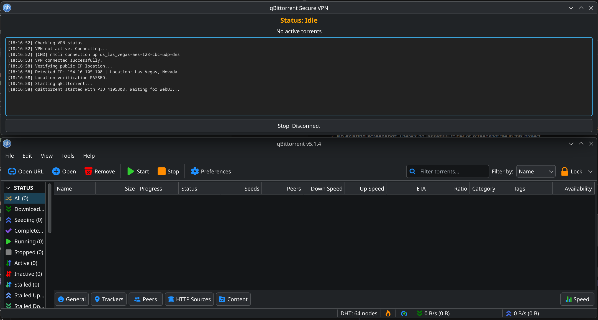

# qBittorrent Secure VPN Wrapper

A safety wrapper for qBittorrent that ensures a valid VPN connection and IP location before launching the application. It includes a dashboard that attaches itself to the qBittorrent window and provides auto-shutdown capabilities when downloads complete.

## Table of Contents
- [Features](#features)
- [Requirements](#requirements)
- [Configuration](#configuration)
- [Usage](#usage)
- [Changelog](#changelog)



## Features
- **VPN Binding**: Automatically connects to a specified NetworkManager VPN profile (default: `us_las_vegas-aes-128-cbc-udp-dns`) before starting.
- **Leak Protection**: Verifies the public IP location (via ip-api.com) matches the expected region (e.g., "Las Vegas") before launching qBittorrent. Includes retry logic (3 attempts) to handle initial connection delays. If verification fails, it aborts.
- **Activity Monitoring**: Polls the qBittorrent WebUI to track active downloads/uploads.
- **Idle Detection**: Automatically triggers a shutdown dialog when all transfers are inactive for a set duration.
- **UI Glue**: Uses `kdotool` to physically attach the status dashboard to the top of the qBittorrent window, moving with it on screen (KDE/Wayland).
- **Auto-Shutdown**: Can close qBittorrent and disconnect the VPN automatically after completion.

## Requirements
- Python 3.12+
- `PyQt6`
- `requests`
- `qbittorrent` (Application + WebUI enabled on port 8080)
- `nmcli` (NetworkManager)
- `kdotool` (for window glue functionality)

## Configuration
Edit the top configuration block in `qbittorrent_vpn_wrapper.py` to match your VPN and expected location:
```python
VPN_CONNECTION_NAME = "your-vpn-connection-name"
EXPECTED_CITY = "City"
EXPECTED_REGION = "Region"
```

## Usage
Run the wrapper directly (it will launch qBittorrent for you):
```bash
./qbittorrent_vpn_wrapper.py
```
Or use the installed desktop shortcut.

## Changelog

### v1.0.3
- Added screenshot to README

### v1.0.2
- Added retry logic (3 attempts) for public IP verification to handle initial connection delays

### v1.0.1
- Added seeding management dialog with shutdown scheduling
- Added torrent removal options

### v1.0.0
- Initial release
- VPN binding with IP geolocation verification
- Activity monitoring via qBittorrent WebUI
- Idle detection with auto-shutdown dialog
- Window glue functionality via kdotool
