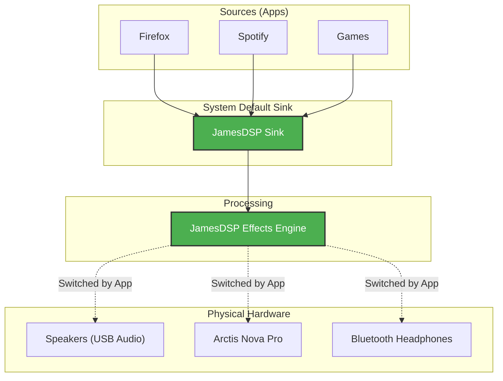

# Audio Source Switcher

A powerful PyQt6-based utility for Linux (specifically KDE Plasma/Wayland) to manage audio output devices and Bluetooth connections.

## Features

- **Smart Device List**: Shows PulseAudio sinks and Bluetooth devices in a unified list.
- **Priority Auto-Switching**: Drag-and-drop devices to reorder. The app automatically switches to the highest-priority connected device.
- **Offline Management**: Remembers devices even when they are disconnected, allowing you to maintain your priority order.
- **Improved Bluetooth Support**:
    - Connect/Disconnect directly from the UI.
    - **Connect on Select**: Clicking an offline Bluetooth device triggers an auto-connect sequence.
    - **Stable Naming**: Uses MAC addresses to properly identify devices like AirPods.
- **Headset Integration**:
    - Supports **SteelSeries Arctis Nova Pro Wireless**.
    - Displays battery percentage (e.g., `[87%]`) when connected via USB.
    - Detects "disconnected" state correctly (when powered off) to allow auto-switching to speakers.
- **System Tray**:
    - Minimizes to tray on close.
    - Notifications on auto-switch (via `notify-send`).

## Audio Routing & JamesDSP Integration

This tool includes smart integration for **JamesDSP**. Instead of simply changing the system default sink (which would bypass effects), it intelligently rewires the PipeWire graph.

### How it Works

When JamesDSP is running, the app treats it as a **Virtual Output Filter**.
1.  **Apps** send audio to `jamesdsp_sink` (System Default).
2.  **JamesDSP** processes the audio.
3.  **The Switcher** automatically connects JamesDSP's *Output* to your chosen physical device (Speakers, Headphones).



**Benefits:**
- **No Effect Dropouts**: You never lose your EQ/Bass Boost when switching devices.
- **Auto-Switching**: If your Headphones disconnect, the app detects the "Floating" JamesDSP output and immediately rewires it to your Speakers.


## CLI & Global Hotkeys

Since version 8, you can control the app from the command line, which is perfect for setting up global hotkeys (especially on Wayland).

### Usage
```bash
# Connect/Switch to a specific device (by name or ID)
python3 select_audio.py --connect "AirPods Pro"

# The app effectively "Headless" in this mode:
# - If the device is connected, it switches audio immediately.
# - If the device is a Bluetooth device and is offline, it auto-connects, waits, and then switches.
# - You get a system notification with the result.
```

### Setting up a Hotkey (KDE Plasma)
1.  Open the app and **Right-Click** the device you want to bind.
2.  Select **"Copy Hotkey Command"**.
3.  Go to **System Settings** -> **Shortcuts** -> **Custom Shortcuts**.
4.  Create a new shortcut, name it (e.g., "Connect Headphones").
5.  Paste the command into the **Action/Command** field.
6.  Assign your desired key combination (e.g., `Meta+H`).

## Requirements

- Python 3
- `PyQt6`
- `pulseaudio` / `pipewire-pulse` (pactl)
- `bluez` (bluetoothctl)
- `libnotify` (notify-send)
- `headsetcontrol` (optional, for Arctis Nova battery/status)

## Installation

1.  **Dependencies**:
    ```bash
    sudo pacman -S python-pyqt6 libnotify bluez-utils
    # Install headsetcontrol from AUR if you have SteelSeries devices
    ```

2.  **Desktop Shortcut**:
    Copy the provided `.desktop` file to your applications folder:
    ```bash
    cp select-audio-source.desktop ~/.local/share/applications/
    update-desktop-database ~/.local/share/applications/
    ```

## Configuration

Device priority and settings are saved to `~/.config/select-audio-source/config.json`.
