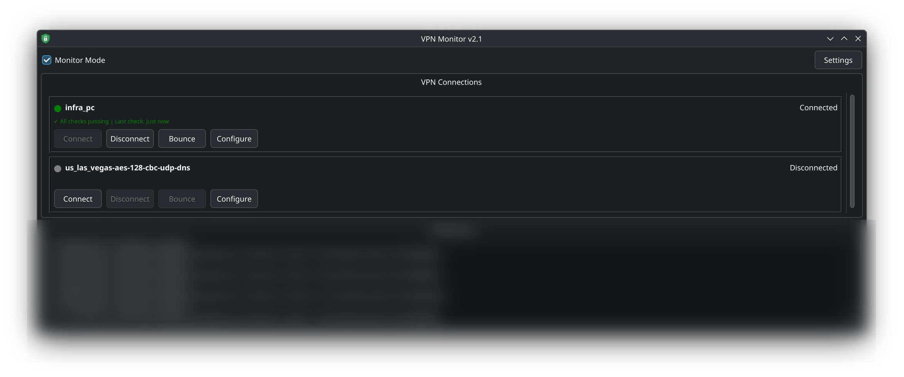

# VPN Toggle

A comprehensive VPN management tool with integrated monitoring and health checking for NetworkManager connections.

## Table of Contents
- [Version 2.0 (Monitor Mode)](#version-20-monitor-mode)
- [Features](#features-v20)
- [Installation](#installation)
- [Usage](#usage-v20)
- [Configuration](#configuration)
- [Version 1.0 (Legacy)](#version-10-legacy)
- [Changelog](#changelog)

## Version 2.0 (Monitor Mode)

VPN Toggle v2.0 is a complete rewrite featuring a persistent GUI with integrated monitoring capabilities.



### Features (v2.0)

#### Core Features
- **Persistent GUI**: PyQt6-based window showing all configured VPNs
- **Manual Controls**: Connect, disconnect, and bounce any VPN with one click
- **Real-time Status**: Live status updates and connection monitoring

#### Monitor Mode
- **Health Checking**: Automated assert-based VPN health monitoring
- **Auto-Reconnect**: Automatic reconnection on assert failures
- **Failure Tracking**: Configurable failure thresholds with automatic VPN disable
- **Grace Period**: Prevents checks immediately after connection

#### Assert Types
1. **DNS Lookup Assert**
   - Verifies DNS resolution matches expected IP prefix
   - Supports partial matching (e.g., "100." matches "100.64.1.5")

2. **Geolocation Assert**
   - Verifies public IP originates from expected location
   - Uses ip-api.com (free, no API key required)
   - Supports city, region, and country checks
   - Prints detected location for easy configuration

#### Configuration
- **Persistent Settings**: JSON-based configuration in `~/.config/vpn-toggle/config.json`
- **Per-VPN Configuration**: Individual assert and monitor settings per VPN
- **Window Position**: Saves and restores window geometry
- **Customizable Timing**: Adjustable check intervals, grace periods, and failure thresholds

### Installation

```bash
./install.sh
```

This will:
- Install dependencies (PyQt6, requests)
- Create `vpn-toggle-v2` command in `~/.local/bin`
- Add desktop launcher to application menu

### Usage (v2.0)

#### Launch the Application

```bash
vpn-toggle-v2
```

Or search for "VPN Toggle" in your application launcher.

#### Command-Line Options

```bash
vpn-toggle-v2 [options] [vpn_name]

Options:
  --debug         Enable debug logging
  --config PATH   Use custom config file
  --version       Show version information
  --help          Show help message

Arguments:
  vpn_name        (Legacy - ignored) VPN name for v1.0 compatibility
```

#### Using Monitor Mode

1. **Enable Monitoring**: Check the "Monitor Mode" checkbox
2. **Configure VPN**: Click "Configure" on a VPN to set up asserts
3. **View Activity**: Monitor health checks in the Activity Log
4. **Adjust Settings**: Click "Settings" to customize timing and thresholds

#### Configuration File

Located at `~/.config/vpn-toggle/config.json`:

```json
{
  "version": "2.0.0",
  "monitor": {
    "enabled": true,
    "check_interval_seconds": 120,
    "grace_period_seconds": 15,
    "failure_threshold": 3
  },
  "vpns": [
    {
      "name": "us_las_vegas-aes-128-cbc-udp-dns",
      "display_name": "Las Vegas",
      "enabled": true,
      "asserts": [
        {
          "type": "dns_lookup",
          "hostname": "myip.opendns.com",
          "expected_prefix": "100.",
          "description": "Verify IP starts with 100."
        },
        {
          "type": "geolocation",
          "field": "city",
          "expected_value": "Las Vegas",
          "description": "Verify IP from Las Vegas"
        }
      ]
    }
  ]
}
```

### Requirements

- Python 3.8+
- NetworkManager (nmcli)
- PyQt6
- requests library
- Linux desktop environment (KDE/GNOME)

### Uninstallation

```bash
./uninstall.sh
```

---

## Version 1.0 (Legacy)

The original bash script is still available as `toggle_vpn.sh` for backward compatibility.

### Features (v1.0)
- **Smart Detection**: Fuzzy-matches connection names
- **GUI Menu**: Popup dialog (kdialog/zenity)
- **Quick Actions**: Enable, disable, bounce, configure
- **Desktop Notifications**: Visual feedback on status changes

### Usage (v1.0)

#### Basic
```bash
./toggle_vpn.sh
```

#### Specific Connection
```bash
./toggle_vpn.sh "office"
```

#### Integration
Bind to a global hotkey (e.g., Meta+V) in your desktop environment

## Changelog

### v2.1.0
- **Application Icon**: Custom SVG shield icon for window title bar and desktop launcher
- **Log Line Limiting**: Activity log capped at 500 lines to prevent unbounded memory growth
- **Installer/Uninstaller**: Updated to install and clean up the custom icon
- GUI tests added for log limiting behavior (70 total tests)

### v2.0.0
- **Major rewrite**: Python + PyQt6 GUI application
- **Monitor Mode**: Integrated health checking with auto-reconnect
- **Assert System**: DNS lookup and geolocation verification
- **Persistent GUI**: Window showing all VPNs with real-time status
- **Configuration**: JSON-based persistent configuration
- **Multi-VPN Support**: Manage all VPNs from single interface
- **Activity Log**: Real-time monitoring events display
- **Window Persistence**: Saves and restores window position
- **Customizable Thresholds**: Configurable check intervals and failure limits
- All core functionality implemented with 64 passing tests

### v1.0.0
- Initial release (bash script)
- Fuzzy connection name matching
- GUI menu via kdialog/zenity
- Enable/Disable/Bounce/Config actions
- Desktop notifications
