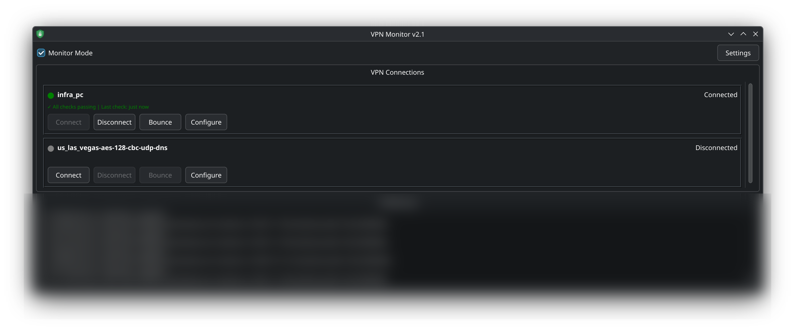

# VPN Toggle

A comprehensive VPN management tool with integrated monitoring and health checking for NetworkManager connections.

## Table of Contents
- [Version 4.3 (Event-Driven Monitor & Reliability)](#version-43-event-driven-monitor--reliability)
- [Version 3.2 (System Tray & Autostart)](#version-32-system-tray--autostart)
- [Version 3.1 (UX Improvements)](#version-31-ux-improvements)
- [Version 3.0 (Metrics Dashboard)](#version-30-metrics-dashboard)
- [Version 2.0 (Monitor Mode)](#version-20-monitor-mode)
- [Features](#features-v20)
- [Installation](#installation)
- [Usage](#usage-v20)
- [Configuration](#configuration)
- [Version 1.0 (Legacy)](#version-10-legacy)
- [Changelog](#changelog)

## Version 4.3 (Event-Driven Monitor & Reliability)

VPN Toggle v4.3 replaces the QThread-based monitor with a fully event-driven architecture, fixes a recurring crash, and adds first-class systemd integration.

### Crash fix and reliability

After three SIGSEGV crashes in libpython3.14 in the span of a week — all originating from `json.dump` in the metrics writer being invoked through a cross-thread Qt signal — the monitor was rebuilt to remove the conditions that reproduced the bug. See [`specs/009-event-driven-monitor.md`](specs/009-event-driven-monitor.md) and the crash analysis under [`validation-reports/`](validation-reports/).

### Event-driven monitor

- **`MonitorThread(QThread)` is gone.** Replaced by `MonitorController(QObject)` running entirely on the main event loop.
- All subprocess work (`nmcli`, `openvpn3`, `ping`) now goes through `QProcess`. DNS lookups use `QDnsLookup`. Geolocation HTTP uses `QNetworkAccessManager`. None of these block the event loop.
- Each check cycle is a `VPNCheckSession` state machine: `is_vpn_active_async` → assert chain → either record metrics or trigger an async bounce.
- Every async op carries a hard timeout (`QTimer.singleShot`) so a hung subprocess or DNS query cannot wedge a session.
- All five existing signals (`status_changed`, `assert_result`, `log_message`, `vpn_disabled`, `check_completed`) are preserved with identical payloads, so the GUI wiring is unchanged.

### Append-only metrics + log rotation

- `MetricsCollector` storage moved from "rewrite the whole `{vpn}.json` blob every check" to **append-one-line-per-check** `{vpn}.jsonl`. Periodic compaction keeps the file capped at the in-memory tail (`MAX_DATA_POINTS=10000`, `COMPACT_EVERY_N=500`).
- A crash mid-write at worst truncates the final partial line instead of corrupting the entire history.
- Application log is now rotated via `RotatingFileHandler` (2 MB × 5 files = 10 MB total cap). Existing pre-v4.3 logs are left in place; the new rotation kicks in on the next write.
- Legacy `{vpn}.json` files are migrated to `{vpn}.jsonl` automatically on first load.

### Systemd user unit

- **`install.sh` now installs and enables a systemd user unit** (`~/.config/systemd/user/vpn-toggle.service`) with `Restart=on-failure` and `RestartSec=5s`.
- Service auto-starts on graphical-session login, auto-restarts on crash (with rate limiting: max 5 restarts in 5 minutes), and ships stdout/stderr to the journal.
- Unit template lives at [`systemd/vpn-toggle.service.template`](systemd/vpn-toggle.service.template); the installer substitutes the install path on copy.
- `uninstall.sh` cleanly disables and removes the unit.

### What did not change

User-facing GUI surface, configuration schema, signals emitted by the monitor, and on-disk file paths under `~/.config/vpn-toggle/` are all unchanged. Existing config and metrics carry forward without intervention.

---

## Version 3.2 (System Tray & Autostart)

VPN Toggle v3.2 adds system tray integration, autostart-on-login support, and VPN connection restore on startup.

### System Tray

- **Tray Icon**: App icon appears in the system tray on startup (when tray is available)
- **Close to Tray**: Closing the window hides it to the tray instead of quitting — the monitor thread keeps running in the background
- **Context Menu**: Right-click the tray icon for Show/Hide, Monitor Mode toggle, and Quit
- **Left-Click**: Toggles window visibility
- **Tooltip**: Shows app name and number of active VPNs
- **Fallback**: When no system tray is available (tiling WMs, headless), close behaves as before (quit)

### Autostart on Login

- **Settings Toggle**: Enable/disable autostart from the Settings dialog
- **XDG Autostart**: Creates/removes `~/.config/autostart/vpn-toggle-v2.desktop`
- **Start Minimized**: Option to start with the window hidden (tray icon only)
- **`--minimized` CLI Flag**: Start the app with the window hidden

### VPN Connection Restore

- **Automatic Restore**: On startup, reconnects VPNs that were previously connected
- **Tracked State**: Connected VPNs are tracked in `config.json` and updated on connect/disconnect
- **Explicit Disconnect**: Only manual disconnect removes a VPN from the restore list (network drops do not)
- **Settings Toggle**: Enable/disable restore from the Settings dialog
- **Logged**: Each restore attempt is logged to the activity log

### Quit

- **Tray Menu**: "Quit" in the tray context menu fully exits the application
- **Window Button**: "Quit" button in the toolbar for full exit without using the tray

---

## Version 3.1 (UX Improvements)

VPN Toggle v3.1 improves the metrics dashboard with human-readable time labels and adds real-time connection duration tracking.

### Graph Time Axis

- **Real Clock Time**: X-axis now displays actual time of day (e.g., 17:00, 17:05) instead of seconds-since-start offset
- Uses pyqtgraph's `DateAxisItem` which auto-scales labels based on zoom level (HH:MM for hours, HH:MM:SS when zoomed in)

### Connection Time Counter

- **Live Duration Display**: Each connected VPN shows a real-time `DD:HH:MM:SS` counter in the header row
- Fetches actual activation timestamp from NetworkManager on first detection, so the counter is accurate even if the app starts after the VPN connected
- Updates every second; clears automatically on disconnect

---

## Version 3.0 (Metrics Dashboard)

VPN Toggle v3.0 adds real-time metrics tracking and graphing to the VPN monitor. Each health check cycle records probe latency and pass/fail status. A time-series graph displays this data alongside the VPN connection cards, with bounce events prominently marked.



### Features (v3.0)

#### Metrics Collection
- **Probe Latency Tracking**: Wall-clock timing of each health check cycle using `time.perf_counter()`
- **Per-Assert Breakdown**: Individual latency measured for DNS lookup and geolocation asserts
- **Pass/Fail Recording**: Every check cycle outcome is recorded
- **Bounce Event Tracking**: Auto-reconnect events are marked in the data

#### Real-Time Graph (pyqtgraph)
- **Time-Series Line Chart**: Latency plotted over time with auto-scrolling
- **Color-Coded VPN Lines**: Each VPN gets a distinct color in a unified graph
- **Status Markers**: Green dots for passing checks, red X markers for failures
- **Bounce Indicators**: Vertical red dashed lines with "Bounce" labels for reconnect events
- **Interactive**: Mouse zoom and pan via pyqtgraph built-in controls
- **Legend**: Displays VPN name-to-color mapping when multiple VPNs have data

#### Statistics Summary
- **Avg Latency**: Mean probe latency across all recorded checks per VPN
- **Total Failures**: Count of failed check cycles per VPN
- **Uptime %**: Calculated as `(total_checks - failures) / total_checks * 100`
- Displayed in each VPN widget below the existing status line

#### Data Persistence
- Metrics stored as JSON files in `~/.config/vpn-toggle/metrics/`
- One file per VPN, loaded on startup to populate the graph with historical data
- Retention limit of 10,000 data points per VPN with FIFO trimming
- "Clear History" button with confirmation dialog to reset all data

#### UI Layout
- **Horizontal Split**: QSplitter divides VPN list (left ~40%) and graph panel (right ~60%)
- **User-Resizable**: Drag the splitter divider to resize panels
- **Wider Window**: Default width increased from 800 to 1100
- Activity log remains full-width at the bottom

---

## Version 2.0 (Monitor Mode)

VPN Toggle v2.0 is a complete rewrite featuring a persistent GUI with integrated monitoring capabilities.

### Features (v2.0)

#### Core Features
- **Persistent GUI**: PyQt6-based window showing all configured VPNs
- **Manual Controls**: Connect, disconnect, and bounce any VPN with one click
- **Real-time Status**: Live status updates and connection monitoring

#### Monitor Mode
- **Health Checking**: Automated assert-based VPN health monitoring
- **Auto-Reconnect**: Automatic reconnection on assert failures
- **Failure Tracking**: Configurable failure thresholds with automatic VPN disable
- **Grace Period**: Prevents checks immediately after connection

#### Assert Types
1. **DNS Lookup Assert**
   - Verifies DNS resolution matches expected IP prefix
   - Supports partial matching (e.g., "100." matches "100.64.1.5")

2. **Geolocation Assert**
   - Verifies public IP originates from expected location
   - Uses ip-api.com (free, no API key required)
   - Supports city, region, and country checks
   - Prints detected location for easy configuration

#### Configuration
- **Persistent Settings**: JSON-based configuration in `~/.config/vpn-toggle/config.json`
- **Per-VPN Configuration**: Individual assert and monitor settings per VPN
- **Window Position**: Saves and restores window geometry
- **Customizable Timing**: Adjustable check intervals, grace periods, and failure thresholds

### Installation

```bash
./install.sh
```

This will:
- Install dependencies (PyQt6, requests)
- Create `vpn-toggle-v2` command in `~/.local/bin`
- Add desktop launcher to application menu

### Usage (v2.0)

#### Launch the Application

```bash
vpn-toggle-v2
```

Or search for "VPN Toggle" in your application launcher.

#### Command-Line Options

```bash
vpn-toggle-v2 [options] [vpn_name]

Options:
  --debug         Enable debug logging
  --config PATH   Use custom config file
  --minimized     Start minimized to system tray
  --version       Show version information
  --help          Show help message

Arguments:
  vpn_name        (Legacy - ignored) VPN name for v1.0 compatibility
```

#### Using Monitor Mode

1. **Enable Monitoring**: Check the "Monitor Mode" checkbox
2. **Configure VPN**: Click "Configure" on a VPN to set up asserts
3. **View Activity**: Monitor health checks in the Activity Log
4. **Adjust Settings**: Click "Settings" to customize timing and thresholds

#### Configuration File

Located at `~/.config/vpn-toggle/config.json`:

```json
{
  "version": "2.0.0",
  "monitor": {
    "enabled": true,
    "check_interval_seconds": 120,
    "grace_period_seconds": 15,
    "failure_threshold": 3
  },
  "vpns": [
    {
      "name": "us_las_vegas-aes-128-cbc-udp-dns",
      "display_name": "Las Vegas",
      "enabled": true,
      "asserts": [
        {
          "type": "dns_lookup",
          "hostname": "myip.opendns.com",
          "expected_prefix": "100.",
          "description": "Verify IP starts with 100."
        },
        {
          "type": "geolocation",
          "field": "city",
          "expected_value": "Las Vegas",
          "description": "Verify IP from Las Vegas"
        }
      ]
    }
  ]
}
```

### Requirements

- Python 3.8+
- NetworkManager (nmcli)
- PyQt6
- requests library
- pyqtgraph (for metrics dashboard)
- numpy (transitive dependency of pyqtgraph)
- Linux desktop environment (KDE/GNOME)

### Uninstallation

```bash
./uninstall.sh
```

---

## Version 1.0 (Legacy)

The original bash script is still available as `toggle_vpn.sh` for backward compatibility.

### Features (v1.0)
- **Smart Detection**: Fuzzy-matches connection names
- **GUI Menu**: Popup dialog (kdialog/zenity)
- **Quick Actions**: Enable, disable, bounce, configure
- **Desktop Notifications**: Visual feedback on status changes

### Usage (v1.0)

#### Basic
```bash
./toggle_vpn.sh
```

#### Specific Connection
```bash
./toggle_vpn.sh "office"
```

#### Integration
Bind to a global hotkey (e.g., Meta+V) in your desktop environment

## Changelog

### v4.3.0

- **Event-driven monitor**: replaced `MonitorThread(QThread)` with `MonitorController(QObject)` running entirely on the main event loop; eliminates the cross-thread Qt signal path implicated in three SIGSEGV crashes
- **Async asserts**: `AsyncDNSLookupAssert` (QDnsLookup), `AsyncGeolocationAssert` (QNetworkAccessManager), `AsyncPingAssert` (QProcess) replace blocking `socket.gethostbyname` / `requests.get` / `subprocess.run` calls in the monitor path
- **Async backends**: `nmcli` and `openvpn3` operations exposed as `QProcess`-backed `*_async` methods; bounce becomes a `BounceOperation` state machine (disconnect → wait → connect)
- **Append-only metrics**: `MetricsCollector` now writes `{vpn}.jsonl` one line per check with periodic compaction; legacy `{vpn}.json` files migrated on first load
- **Log rotation**: `RotatingFileHandler` caps `~/.config/vpn-toggle/vpn-toggle.log` at 10 MB (2 MB × 5 files)
- **Systemd user unit**: `install.sh` installs `vpn-toggle.service` with `Restart=on-failure`, auto-starts on graphical-session login; `uninstall.sh` removes it cleanly
- **Tests**: 193 total (+ 31 new across `test_metrics.py`, `test_async_asserts.py`, `test_monitor_controller.py`); old `test_monitor.py` removed (covered private QThread internals that no longer exist)
- See [`specs/009-event-driven-monitor.md`](specs/009-event-driven-monitor.md) for the full implementation spec

### v3.2.1

- **Tray Icon Fix**: Tray icon now renders correctly on KDE Plasma/Wayland by constructing QIcon from SVG path for SNI compatibility
- **Single-Instance Guard**: Prevents running multiple instances; second launch activates existing window via QLocalServer/QLocalSocket IPC
- **Symlink Icon Fix**: Resolves `__file__` symlinks so icon loads correctly when launched via `~/.local/bin` symlink
- **22px Icon Size**: Added 22x22 pixmap for KDE system tray compatibility
- 149 total tests

### v3.2.0

- **System Tray**: App runs in system tray; closing the window hides to tray instead of quitting
- **Tray Context Menu**: Show/Hide, Monitor Mode toggle, Quit
- **Close-to-Tray**: Monitor thread keeps running when window is hidden; falls back to normal close when tray unavailable
- **Autostart on Login**: XDG Autostart toggle in Settings creates/removes `~/.config/autostart/vpn-toggle-v2.desktop`
- **Start Minimized**: `--minimized` CLI flag and Settings option to launch with window hidden
- **VPN Connection Restore**: Automatically reconnects previously-connected VPNs on startup
- **Quit Button**: Added to window toolbar for full application exit
- **Uninstaller**: Now removes autostart desktop file
- 143 total tests

### v3.1.0

- **Graph Time Axis**: X-axis shows real clock time (HH:MM) via `DateAxisItem` instead of seconds-since-start offset
- **Connection Time Counter**: Live `DD:HH:MM:SS` duration display per VPN, fetches activation time from NetworkManager
- 119 total tests

### v3.0.0
- **Metrics Dashboard**: Real-time time-series graph of probe latency using pyqtgraph
- **Metrics Collection**: Per-check-cycle timing with `time.perf_counter()`, per-assert breakdown
- **Statistics Summary**: Avg latency, total failures, uptime % displayed per VPN widget
- **Data Persistence**: JSON-based metrics storage in `~/.config/vpn-toggle/metrics/` with 10K point retention
- **Unified Graph**: Color-coded lines per VPN with pass/fail markers and bounce event indicators
- **UI Restructure**: Horizontal QSplitter layout (VPN list left, graph right), default width 1100
- **Clear History**: Button to reset all metrics with confirmation dialog
- New dependency: pyqtgraph (+ numpy)
- 110 total tests

### v2.1.0
- **Application Icon**: Custom SVG shield icon for window title bar and desktop launcher
- **Log Line Limiting**: Activity log capped at 500 lines to prevent unbounded memory growth
- **Installer/Uninstaller**: Updated to install and clean up the custom icon
- GUI tests added for log limiting behavior (70 total tests)

### v2.0.0
- **Major rewrite**: Python + PyQt6 GUI application
- **Monitor Mode**: Integrated health checking with auto-reconnect
- **Assert System**: DNS lookup and geolocation verification
- **Persistent GUI**: Window showing all VPNs with real-time status
- **Configuration**: JSON-based persistent configuration
- **Multi-VPN Support**: Manage all VPNs from single interface
- **Activity Log**: Real-time monitoring events display
- **Window Persistence**: Saves and restores window position
- **Customizable Thresholds**: Configurable check intervals and failure limits
- All core functionality implemented with 64 passing tests

### v1.0.0
- Initial release (bash script)
- Fuzzy connection name matching
- GUI menu via kdialog/zenity
- Enable/Disable/Bounce/Config actions
- Desktop notifications
