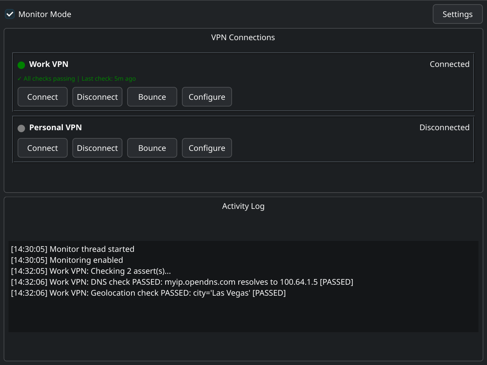
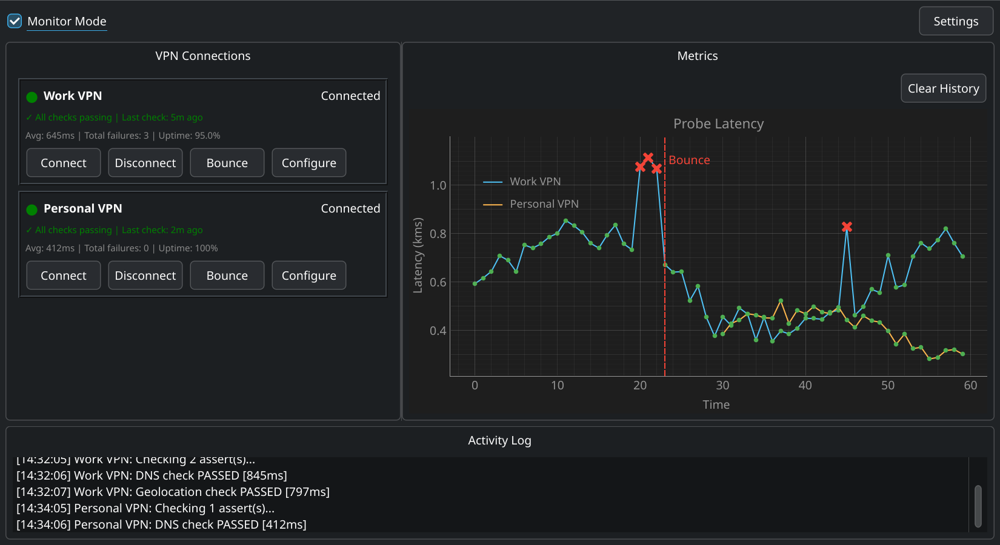

# Spec 004: VPN Metrics Dashboard & Graphing (v3.0)

**Status: COMPLETE**

## Description

Add real-time metrics tracking and graphing to the VPN monitor. Each health check cycle records probe latency and pass/fail status. A time-series graph displays this data alongside the VPN connection cards. Failure events that trigger a VPN bounce are prominently marked on the graph. The existing status info row expands into a statistics summary. All metrics data persists to disk and survives restarts.

## Requirements

### 1. Metrics Collection

**What to measure per check cycle:**

| Metric | Source | Why It's Interesting |
|--------|--------|---------------------|
| **Probe latency** (ms) | Wall-clock time for `_check_vpn()` to complete all asserts | Represents the health of the full network path through the VPN tunnel. A DNS lookup + geolocation API call exercises both resolution and HTTP egress. Latency spikes often predict failures before they happen. |
| **Pass/Fail** | Boolean outcome of the check cycle | Core health signal |
| **Bounce event** | Whether the failure triggered an auto-reconnect | Marks significant disruption events on the graph |
| **Individual assert latency** (ms) | Wall-clock time per assert (DNS, geolocation separately) | Stored in history for future drill-down, but only total probe latency is graphed to keep the chart clean |

**Data point structure** (one per check cycle, per VPN):
```python
{
    "timestamp": "2026-02-12T14:30:05.123",  # ISO 8601
    "vpn_name": "my-vpn",
    "latency_ms": 842.5,                      # Total probe time
    "success": true,                           # Overall pass/fail
    "bounce_triggered": false,                 # Did this failure cause a bounce?
    "assert_details": [                        # Per-assert breakdown
        {"type": "dns_lookup", "latency_ms": 45.2, "success": true},
        {"type": "geolocation", "latency_ms": 797.3, "success": true}
    ]
}
```

### 2. Statistics Summary (Replaces Info Row)

The current single-line info row in each VPN widget:
```
✓ All checks passing | Last check: 5m ago
```

Becomes a compact multi-line statistics area:
```
✓ All checks passing | Last check: 5m ago
Avg latency: 845ms | Total failures: 3 | Uptime: 99.2%
```

**Statistics displayed:**
- **Status + last check** (existing, keep as-is)
- **Avg latency**: Mean probe latency across all recorded checks for this VPN
- **Total failures**: Count of failed check cycles since tracking was enabled
- **Uptime %**: `(total_checks - total_failures) / total_checks * 100`

When VPN is disconnected or no data exists, stats show "No data" or are hidden (same behavior as current info_label).

### 3. Time-Series Graph

**Library: pyqtgraph**
- PyQt6-compatible, native QWidget embedding
- Purpose-built for real-time scientific visualization (1000+ FPS capable)
- Lightweight dependency (only requires numpy)
- Supports scatter markers, infinite lines, annotations
- `pip install pyqtgraph`

**Graph specifications:**
- **Type**: Time-series line chart with scatter overlay
- **X-axis**: Time (human-readable, auto-scaled)
- **Y-axis**: Latency in milliseconds
- **Lines**: One color-coded latency line per VPN (auto-assigned distinct colors, with VPN display name in legend)
- **Pass markers**: Small green dots on the line for successful checks
- **Fail markers**: Larger red X markers for failed checks
- **Bounce markers**: Vertical red dashed line spanning the full Y-axis with a label "Bounce" — these must be visually prominent since they represent significant disruption events
- **Legend**: pyqtgraph legend showing VPN name → line color mapping (shown when multiple VPNs have data)
- **Auto-scroll**: Graph follows the latest data, showing the most recent N data points (configurable, default 100 points visible)
- **Zoom/pan**: pyqtgraph provides this out of the box via mouse interaction
- **Background**: Dark theme to match common monitoring dashboards (configurable via pyqtgraph defaults)

**One unified graph** for all VPNs. Each VPN gets its own color-coded line in the same chart. This keeps the graph panel clean and allows visual comparison of latency across VPNs. Per-VPN stats remain in each VPN widget on the left side.

### 4. UI Layout Changes

**Current layout** (v2.1):



**New layout** (v3.0 — horizontal split with metrics graph):



**Key layout details:**
- Main content area splits horizontally: VPN list (left ~40%) | Graph panel (right ~60%)
- Use a `QSplitter` so users can drag the divider to resize
- Activity log remains full-width at the bottom
- Graph panel header includes a "Clear" button (dropdown or simple button) to reset history
- Default window width increases from 800 to 1100 to accommodate the graph panel
- Minimum window width: 800 (graph panel collapses gracefully at small sizes)

### 5. Data Persistence

**Storage location**: `~/.config/vpn-toggle/metrics/`
- One JSON file per VPN: `<vpn_name>.json`
- Separate from main config to keep metrics data independent

**File format**:
```json
{
    "vpn_name": "my-vpn",
    "created": "2026-02-12T10:00:00",
    "data_points": [
        {
            "timestamp": "2026-02-12T14:30:05.123",
            "latency_ms": 842.5,
            "success": true,
            "bounce_triggered": false,
            "assert_details": [...]
        }
    ]
}
```

**Retention policy:**
- Keep up to 10,000 data points per VPN (at 120s intervals, ~14 days of continuous monitoring)
- When limit is reached, drop the oldest 10% (FIFO trimming)
- Saves after every check cycle (append + periodic full write)

**Clear history:**
- "Clear" button in graph panel header
- Confirmation dialog: "Clear all metrics history for all VPNs? This cannot be undone."
- Deletes all files in `~/.config/vpn-toggle/metrics/`
- Resets in-memory stats and graph

### 6. New Dependency

- **pyqtgraph** (`pip install pyqtgraph`) — requires numpy as a transitive dependency
- Both are well-established packages with no known security concerns
- Add to README dependencies section

## Architecture

### New Components

1. **MetricsCollector** (`vpn_toggle/metrics.py`)
   - Records data points from monitor thread check cycles
   - Computes aggregate statistics (avg latency, total failures, uptime %)
   - Handles persistence (save/load JSON files)
   - Thread-safe (called from MonitorThread, read from GUI thread)

2. **MetricsGraphWidget** (`vpn_toggle/graph.py`)
   - pyqtgraph-based widget that renders the time-series chart
   - Accepts data points and updates in real-time
   - Handles multiple VPN graphs (stacked)
   - Provides Clear button and graph controls

### Modified Components

1. **MonitorThread** (`vpn_toggle/monitor.py`)
   - Add timing instrumentation around assert execution
   - Emit new signal with metrics data point after each check cycle
   - Signal: `check_completed(str, dict)` — vpn_name, data_point

2. **VPNWidget** (`vpn_toggle/gui.py`)
   - Expand `info_label` to `stats_layout` with two lines
   - Read aggregate stats from MetricsCollector

3. **VPNToggleMainWindow** (`vpn_toggle/gui.py`)
   - Restructure layout: horizontal split with QSplitter
   - Add MetricsGraphWidget to right panel
   - Connect new monitor signal to graph updates
   - Increase default window width to 1100
   - Add Clear button in graph panel header

4. **ConfigManager** (`vpn_toggle/config.py`)
   - Add `metrics` section to config for preferences (retention limit, visible points)

### Signal Flow

```
MonitorThread._check_vpn()
    ├── times assert execution
    ├── emits check_completed(vpn_name, data_point)
    │
    ├──→ MetricsCollector.record(data_point)
    │       ├── updates in-memory stats
    │       └── persists to disk
    │
    └──→ VPNToggleMainWindow.on_check_completed()
            ├── updates MetricsGraphWidget
            └── updates VPNWidget stats display
```

## Acceptance Criteria

### Metrics Collection
- [ ] MonitorThread times each check cycle and emits `check_completed` signal
- [ ] Data point includes: timestamp, latency_ms, success, bounce_triggered, assert_details
- [ ] Individual assert latency is measured separately
- [ ] Timing uses `time.perf_counter()` for accuracy

### Metrics Persistence
- [ ] MetricsCollector saves data to `~/.config/vpn-toggle/metrics/<vpn>.json`
- [ ] Data loads on startup and populates graph with historical data
- [ ] Retention limit of 10,000 points per VPN with FIFO trimming
- [ ] Thread-safe access (monitor thread writes, GUI thread reads)
- [ ] Handles missing/corrupt data files gracefully (start fresh)

### Statistics Display
- [ ] VPN widget info row shows: status + last check (existing line)
- [ ] VPN widget shows second line: avg latency, total failures, uptime %
- [ ] Stats update after each check cycle
- [ ] Stats show "No data" when no history exists
- [ ] Stats hidden when VPN is disconnected (same as current behavior)

### Graph Rendering
- [ ] pyqtgraph PlotWidget renders latency time-series
- [ ] Green dots mark successful checks
- [ ] Red X markers mark failed checks
- [ ] Vertical red dashed lines mark bounce events with "Bounce" label
- [ ] Graph auto-scrolls to show latest data
- [ ] Graph supports mouse zoom and pan (pyqtgraph built-in)
- [ ] Multiple VPNs shown as color-coded lines in one unified graph
- [ ] Legend displayed when multiple VPNs have data

### UI Layout
- [ ] Main content area uses QSplitter (VPN list left, graph right)
- [ ] Default window width increased to 1100
- [ ] Splitter is user-resizable
- [ ] Activity log remains full-width at bottom
- [ ] Layout degrades gracefully at small window sizes
- [ ] "Clear" button in graph panel header clears all history (with confirmation)

### Clear History
- [ ] Clear button shows confirmation dialog
- [ ] Clearing removes JSON files from disk
- [ ] Clearing resets in-memory stats and graph display
- [ ] Graph and stats reflect empty state after clearing

### Testing
- [ ] MetricsCollector unit tests: record, aggregate stats, save/load, FIFO trimming
- [ ] MonitorThread timing tests: check_completed signal emitted with correct data
- [ ] Graph widget tests: data point addition, clear functionality
- [ ] Stats display tests: correct formatting for various states
- [ ] Persistence tests: save/load round-trip, corrupt file handling, retention limit

### Integration
- [ ] Existing 70 tests still pass
- [ ] README updated with new features and pyqtgraph dependency
- [ ] install.sh updated to install pyqtgraph
- [ ] Version bumped to 3.0.0
- [ ] Screenshot updated with synthetic data loaded into the graph (latency variations, a few failures, at least one bounce event) so the graph looks populated and interesting

## Implementation Strategy

Build in small, testable pieces to avoid compound syntax/coding errors:

### Phase A: MetricsCollector (standalone, fully testable)
1. Create `vpn_toggle/metrics.py` with data structures and persistence
2. Write tests for record, aggregate, save/load, trim
3. Verify: `pytest tests/test_metrics.py`

### Phase B: Monitor Thread Instrumentation
1. Add timing to `_check_vpn()` and new `check_completed` signal
2. Write tests for signal emission and timing accuracy
3. Verify: `pytest tests/test_monitor.py` (all existing + new pass)

### Phase C: Graph Widget (can prototype in isolation)
1. Create `vpn_toggle/graph.py` with MetricsGraphWidget
2. If needed, build a standalone test script to verify rendering:
   ```python
   # test_graph_standalone.py - visual verification
   app = QApplication([])
   graph = MetricsGraphWidget()
   graph.add_data_point(...)  # feed sample data
   graph.show()
   app.exec()
   ```
3. Write unit tests for data handling (not rendering)
4. Verify: `pytest tests/test_graph.py`

### Phase D: UI Layout Restructure
1. Modify `VPNToggleMainWindow.setup_ui()` for horizontal split
2. Add MetricsGraphWidget to right panel
3. Expand VPN widget stats area
4. Connect signals
5. Verify: `pytest tests/` (all pass)

### Phase E: Integration & Polish
1. Wire everything together
2. Adjust window sizing and splitter defaults
3. Test with real VPN connections
4. Update README, install.sh, version

## Dependencies

### Existing
- PyQt6
- requests
- pytest

### New
- **pyqtgraph** (`pip install pyqtgraph`) — real-time scientific visualization
- **numpy** (transitive dependency of pyqtgraph)

## Risk Assessment

| Risk | Mitigation |
|------|-----------|
| pyqtgraph visual rendering hard to unit test | Separate data logic from rendering; test data handling, verify rendering manually |
| Metrics file corruption | Graceful fallback: log warning, start fresh. Validate on load |
| Thread contention on metrics data | Use `threading.Lock` in MetricsCollector, keep critical sections short |
| Graph performance with large datasets | Cap visible points (default 100), FIFO trim storage at 10K |
| Window too wide for small screens | QSplitter allows resizing; set sensible minimums |

## Rollback Plan

- **Code-only change**: Revert commit, redeploy
- **Config file**: New `metrics` section is additive; old configs work without it
- **Metrics data**: Stored separately in `metrics/` directory; deleting it has no effect on core functionality
- **New dependency (pyqtgraph)**: Feature is isolated; if pyqtgraph is unavailable, the graph panel could show a "pyqtgraph not installed" message (graceful degradation)
